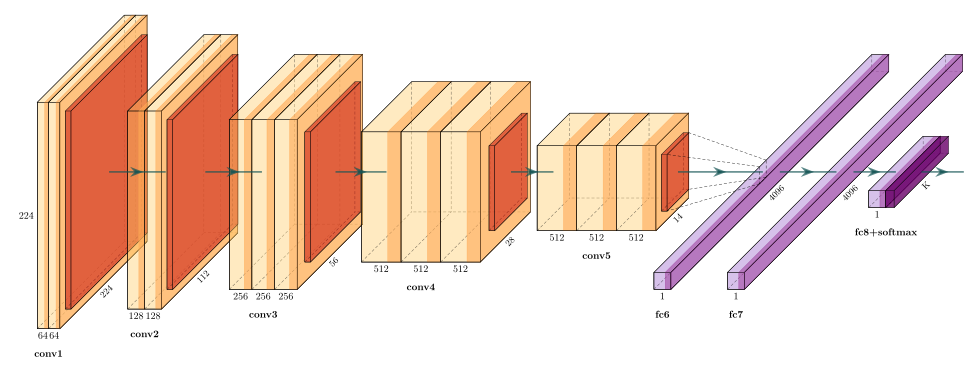

## HAX603X - Stochastic Modeling (2023-2024)

This is an undergraduate course on stochastic modeling and Monte Carlo methods, with exercises in Python.
 
Details can be found here: [HAX603X - Stochastic Modeling](HAX603X).
 
Course language: &#127467;&#127479;

## CR12 - Machine Learning (2013-2015)

This is a Master 2 course on Machine learning (with [Z. Harchaoui](http://faculty.washington.edu/zaid/), [J. Mairal](http://lear.inrialpes.fr/people/mairal/) and [L. Jacob](http://lbbe.univ-lyon1.fr/-Jacob-Laurent-.html?lang=fr)).

Details can be found here:

- [CR12 - Machine Learning (2014-2015)](http://lear.inrialpes.fr/people/mairal/teaching/2014-2015/M2ENS/)
- [CR12 - Machine Learning (2013-2014)](http://lear.inrialpes.fr/people/harchaoui/teaching/2013-2014/ensl/m2/).

Course language: &#127468;&#127463;
