<!-- 

needed the following and the _environnement at root

conda activate quarto-prez
python -m ipykernel install --user --name quarto-prez --display-name "Python (quarto-prez)"

 -->


::: {.hidden}
{{

\DeclareMathOperator*{\argmax}{arg\,max}
\newcommand{\1}{{1\hspace{-3.8pt} 1}}

}}
:::

<style>
    .vertical-line{
        display: inline-block;
        border-left: 6px solid rgb(0, 0, 0);
        margin: 0 10px;
      height: 410px;
        border-radius: 3px;
        overflow: hidden;

}
@import url('https://fonts.googleapis.com/css2?family=Montserrat:wght@400;700&family=Nunito:wght@200;300;400;500;600;700;800;900&family=Roboto+Mono:wght@300;400&family=Sanchez&display=swap');

/* Set default font for entire SVG */
svg {
    font-family: 'Nunito Bold', 'Arial', sans-serif;
}

/* Specific targeting for dinov2 SVG numbers */
img[src*="dinov2-PN.svg"] + svg text,
img[src*="dinov2-PN.svg"] + svg tspan {
    font-family: 'Nunito', sans-serif !important;
    font-weight: 800 !important;
}

/* Specific targeting for dinov2 SVG numbers - extra weight */
svg text:contains("DinoV2"), 
svg tspan:contains("DinoV2"),
svg text:contains("224"), 
svg tspan:contains("224"),
svg text:contains("518") {
    font-family: 'Nunito', Arial, sans-serif !important;
    font-weight: 800 !important;
}

/* Force Nunito for any SVG that might be inline */
object[data*=".svg"] text,
object[data*=".svg"] tspan,
embed[src*=".svg"] text,
embed[src*=".svg"] tspan {
    font-family: 'Nunito', Arial, sans-serif !important;
}


/* avoid scrolling bar and set refs content size */
#refs {
    font-size: 150% !important;
    overflow: visible !important;
    max-height: none !important;
    height: auto !important;
}
.reveal .slides section {
    overflow: visible !important;
}
.reveal .slides {
    overflow: visible !important;
}
.reveal {
    overflow: visible !important;
}


.img-author-container {
    position: relative;
    display: flex;
    flex-direction: column;
    align-items: center;
    justify-content: flex-start;
    min-width: 180px;
    box-sizing: border-box;
}
.img-author-img {
    display: block;
    width: 100% !important;
    object-fit: contain !important;
    background: transparent;
    border-radius: 8px;
    position: relative;
    z-index: 1;
}
.img-author-overlay {
    position: absolute;
    top: 15px;
    right: 35px;
    background: rgba(0,0,0,0.5);
    color: #fff;
    padding: 1px 6px;
    border-radius: 8px;
    font-size: 0.5em;
    font-family: Nunito, Arial, sans-serif;
    font-weight: bold;
    z-index: 2;
    pointer-events: none;
}

/* Make captions immune to long names and keep grid aligned */
.img-author-caption {
     text-align: center;
     font-size: 0.75em;
     color: #222;
     margin-top: 2px;
     font-family: Nunito, Arial, sans-serif;
     height: 2.6em; /* fixed height for one line */
     line-height: 1.3em;
     white-space: normal;
     overflow: hidden;
     text-overflow: ellipsis;
     width: 100%;
     display: block;
}


/* Statistics */

.stats-layout {
  display: grid;
  grid-template-columns: 1fr 0.5fr 1fr;
  grid-template-rows: 1fr 1fr auto;
  gap: 14px;
  width: 100%;
  max-width: 980px;
  margin: 0 auto;
  align-items: stretch;
}
/* Statistics cards */

.stat-card {
  background: #f7f8f6;
  border-radius: 12px;
  padding: 1.0rem 1.15rem;
  text-align: center;
}

/* Top-left */

.stat-users {
  grid-column: 1;
  grid-row: 1;
}

/* Bottom-left */

.stat-queries {
  grid-column: 1;
  grid-row: 2;
}

/* Top-right */

.stat-species {
  grid-column: 3;
  grid-row: 1;
}

/* Bottom-right */

.stat-observations {
  grid-column: 3;
  grid-row: 2;
}

/* Large central tree card */

.stat-tree {
  grid-column: 2;
  grid-row: 1 / 3;

  display: flex;
  align-items: center;
  justify-content: center;

  padding: 1rem;
}

.stat-tree img {
  display: block;
  width: 95%;
  max-width: 300px;
  max-height: 52vh;
  height: auto;
  margin: 0 auto;
}

/* Storage */

.stat-storage {
  grid-column: 1 / -1;
  grid-row: 3;
}

/* Typography */

.stat-value {
  font-size: 1.6em;
  font-weight: 700;
  color: #047C90;
  line-height: 1.1;
}

.stat-label {
  font-size: 0.85em;
  font-weight: 600;
  color: #555;
  margin-top: 0.4rem;
}

.stat-detail {
  font-size: 0.7em;
  color: #888;
  margin-top: 0.15rem;
}

/* Source */

.stats-source {
  max-width: 980px;
  margin: 0.8rem auto 0;
  text-align: right;
  font-size: 0.65em;
  color: #999;
}

/* Smaller screens */

@media (max-width: 700px) {

  .stats-layout {
    grid-template-columns: 1fr 1fr;
    grid-template-rows: auto;
  }

  .stat-tree {
    grid-column: 1 / -1;
    grid-row: 1;
  }

  .stat-users {
    grid-column: 1;
    grid-row: 2;
  }

  .stat-species {
    grid-column: 2;
    grid-row: 2;
  }

  .stat-queries {
    grid-column: 1;
    grid-row: 3;
  }

  .stat-observations {
    grid-column: 2;
    grid-row: 3;
  }

  .stat-storage {
    grid-column: 1 / -1;
    grid-row: 4;
  }

}

#filter-container > div,
#filter-container-2 > div { /* legendBox */
    padding: 5px !important;
    max-width: 100% !important;
}
#filter-container > div > div:first-child,
#filter-container-2 > div > div:first-child { /* legendTitle */
    font-size: 12px !important;
    margin-bottom: 2px !important;
    padding-bottom: 2px !important;
}
#filter-container > div > div:last-child,
#filter-container-2 > div > div:last-child { /* legendGrid */
    gap: 5px !important;
    grid-template-columns: repeat(4, 1fr) !important;
}
/* Flatten the column grouping divs to allow 4-column flow */
#filter-container > div > div:last-child > div:nth-child(n+2),
#filter-container-2 > div > div:last-child > div:nth-child(n+2) {
    display: contents !important;
}
/* Hide the sub-headers (At Group, etc.) */
#filter-container div[role="heading"],
#filter-container-2 div[role="heading"] {
    display: none !important;
}
#filter-container label,
#filter-container-2 label {
    font-size: 10px !important;
    margin-left: 4px !important;
}
#filter-container .status-color-box,
#filter-container-2 .status-color-box {
    width: 10px !important;
    height: 10px !important;
    margin-right: 4px !important;
}
#filter-container input[type="checkbox"],
#filter-container-2 input[type="checkbox"] {
    transform: scale(0.7);
    margin: 0 !important;
}
/* Select All row */
#filter-container > div > div:last-child > div:first-child label,
#filter-container-2 > div > div:last-child > div:first-child label {
    font-size: 11px !important;
}
/* Reduce vertical padding on rows */
#filter-container > div > div:last-child > div > div,
#filter-container-2 > div > div:last-child > div > div {
    padding: 0px !important;
}


/* Biases overview */

.biases-grid {
  display: grid;
  grid-template-columns: repeat(3, 1fr);
  gap: 1.2rem;
  max-width: 1050px;
  margin: 2rem auto 1.5rem;
}

.bias-card {
  background: #f7f8f6;
  border-radius: 16px;
  padding: 1.5rem 1.4rem 1.4rem;
  min-height: 290px;
  text-align: center;
}

.bias-icon {
  font-size: 2rem;
  color: #047C90;
  margin-bottom: 0.7rem;
}

.bias-title {
  font-size: 1.2rem;
  font-weight: 700;
  color: #047C90;
  margin-bottom: 0.8rem;
}

.bias-text {
  font-size: 0.9rem;
  line-height: 1.4;
  color: #555;
  min-height: 3.5em;
}

.bias-examples {
  display: flex;
  flex-wrap: wrap;
  justify-content: center;
  gap: 0.4rem;
  margin-top: 1rem;
}

.bias-examples span {
  background: white;
  border-radius: 20px;
  padding: 0.3rem 0.65rem;
  font-size: 0.7rem;
  color: #777;
}


@media (max-width: 800px) {
  .biases-grid {
    grid-template-columns: 1fr;
  }

  .bias-card {
    min-height: auto;
  }
}


</style>

<!------------------------------------------------------------------------ -->
#### {#title-slide data-menu-title="Title Slide" background="#053660"}

[Citizen science & machine learning for plant Identification: challenges from Pl@ntNet]{.custom-title}


<br>

<!-- <hr class="hr-teal"> -->

<br>

:::: {.columns}

::: {.column width="48% border-right:5px solid rgb(0, 0, 0);"}


[Joseph Salmon]{.custom-subtitle2}

[IMAG, Univ Montpellier, CNRS, Inria, Montpellier, France]{.custom-subtitle3}
<div style="text-align: center;">

{width=100% style="display: block; margin-left: 0; margin-right: auto;"}

</div>

:::

::: {.column width="2%"}

<span class="vertical-line"></span>

:::

::: {.column width="48%"}

<div style="text-align: center;">


[Consortium  Pl@ntnet]{.custom-subtitle2}

{width=89%}

</div>

:::

::::


<!------------------------------------------------------------------------ -->
# Pl@ntNet insights {.section-background}
<!------------------------------------------------------------------------ -->


<!------------------------------------------------------------------------- -->
### Pl@ntNet: ML for citizen science
<hr>


::::{.columns}

::: {.column width="50%"}

<div style="text-align: center;">


{width=40%}

</div>
:::
::: {.column width="10%"}
:::
::: {.column width="40%"}


A machine learning-driven **citizen science** platform for mobile plant identification


:::

::::

:::: {.columns style='display: flex !important'}

::: {.column width="55%"}

<div style="text-align: center;">


- **Birth**: Montpellier,  2009
- **Website**: [https://plantnet.org/](https://plantnet.org/)
- **[Note]{.underline}**: no mushroom identification!
</div>
:::


::: {.column width="30%"}
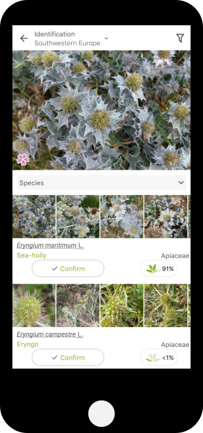{width=60%}
:::


::: {.column width="15%"}


::: {layout-nrow=3  .v-center-container}

<br>
<br>
<br>
<br>


:::

:::

::::
<!------------------------------------------------------------------------ -->


<!------------------------------------------------------------------------ -->
###  Pl@ntNet: usage
<hr>

<br>
<div style="text-align: center;">


</div>
<!------------------------------------------------------------------------ -->


<!------------------------------------------------------------------------ -->
### Pl@ntNet : a digital commons project


```{python}

import os
import sys
import argparse
import requests
from dotenv import load_dotenv


HEADERS = {
    "User-Agent": (
        "Mozilla/5.0 (X11; Linux x86_64) "
        "AppleWebKit/537.36 (KHTML, like Gecko) "
        "Chrome/124.0.0.0 Safari/537.36"
    ),
    "Accept": "application/json, text/plain, */*",
    "Accept-Language": "en-US,en;q=0.9",
}

load_dotenv(".env")  # reads .env from the current working directory into os.environ

def is_notebook():
    try:
        from IPython import get_ipython
        return get_ipython() is not None
    except Exception:
        return False

def get_url():
    # In notebook environments, skip argparse entirely
    if is_notebook():
        url = os.environ.get("STATS_SOURCE_URL", "")
        url = url.strip().strip('"').strip("'")
        return url


    # Normal CLI execution
    parser = argparse.ArgumentParser()
    parser.add_argument("--dotenv", action="store_true", help="Load .env before reading env var")
    parser.add_argument("--url", help="Override: pass the URL directly on the command line")
    args = parser.parse_args()

    if args.dotenv:
        try:
            from dotenv import load_dotenv
            load_dotenv()
            print("[info] Loaded .env")
        except ImportError:
            print("[warn] python-dotenv not installed, skipping (`pip install python-dotenv`)")

    url = args.url or os.environ.get("STATS_SOURCE_URL", "")
    url = url.strip().strip('"').strip("'")
    return url


url = get_url()

if not url:
    print("[error] No URL found. Set STATS_SOURCE_URL env var, or use --url for a one-off test.")
    sys.exit(1)

try:
    resp = requests.get(url, headers=HEADERS, timeout=10)
    resp.raise_for_status()
    data = resp.json()
except Exception:
    raise RuntimeError("Failed to fetch stats — check STATS_SOURCE_URL is set correctly")

def fmt(n):
    return f"{n:,}".replace(",", " ") if isinstance(n, int) else n

def display_float(n):
    return f"{int(n):,}" if isinstance(n, (int, float)) else n
    
species = fmt(data.get("species", "N/A"))
illustrated = fmt(data.get("illustrated_species", "N/A"))
users = fmt(data.get("users", "N/A"))
queries = fmt(data.get("queries", "N/A"))
observations = fmt(data.get("observations", "N/A"))
storage = display_float(data.get("storage", "N/A"))

```

<hr>

<link rel="stylesheet" href="https://unpkg.com/leaflet@1.9.4/dist/leaflet.css" />
<script src="https://unpkg.com/leaflet@1.9.4/dist/leaflet.js"></script>
<link rel="stylesheet" href="https://cdn.jsdelivr.net/npm/nouislider@15.7.1/dist/nouislider.min.css">
<script src="https://cdn.jsdelivr.net/npm/nouislider@15.7.1/dist/nouislider.min.js"></script>


<br>

<div class="stats-layout">

::: {.stat-card .stat-users}

<div class="stat-value">

**`{python} users`**

</div>

<div class="stat-label">

Accounts / users

</div>

:::

::: {.stat-card .stat-species}

<div class="stat-value">

**`{python} illustrated`**

</div>

<div class="stat-label">

(WCVP) Species with photos

</div>

<div class="stat-detail">

out of `{python} species`

</div>

:::

::: {.stat-card .stat-queries}

<div class="stat-value">

**`{python} queries`**

</div>

<div class="stat-label">

Queries

</div>

<div class="stat-detail">

images without species

</div>

:::

::: {.stat-card .stat-observations}

<div class="stat-value">

**`{python} observations`**

</div>

<div class="stat-label">

Observations

</div>

<div class="stat-detail">

images with species

</div>

:::

::: {.stat-card .stat-tree}

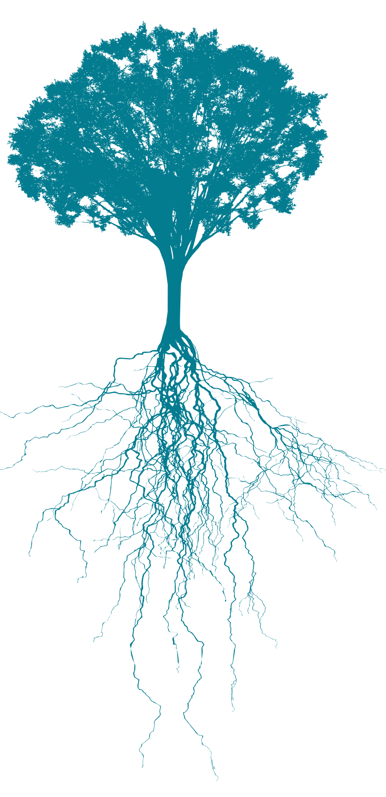

:::

::: {.stat-card .stat-storage}

<div class="stat-value">

**`{python} storage`** TB

</div>

<div class="stat-label">

Storage

</div>

:::

</div>

<div class="stats-source">

Source: <a href="https://identify.plantnet.org/en/stats">Pl@ntNet stats</a>

WCVP: *World Checklist of Vascular Plants* database.

</div>


<!------------------------------------------------------------------------ -->
###  The current Pl@ntNet Team
<!-- copy paste here the full list of plantnet pople -->
```{=html}
<style>
    /* Custom gap and width for 4 images per row */
    .img-author-group-centered.img-4-per-row {
        gap: 3vw 3vw !important;
        justify-content: center;
    }
    .img-author-group-centered.img-4-per-row .img-author-container {
        width: 22vw !important;
        min-width: 180px;
        max-width: 24vw;
    }
</style>
<div class="img-author-group-centered img-4-per-row">
<style>
    .team-slide-container {
        display: flex;
        flex-wrap: wrap;
        justify-content: center;
        gap: 1px 1px;
        font-size: 40%;
        margin: 0 auto;
        max-width: 1200px;
    }
    .team-member {
        display: flex;
        flex-direction: column;
        align-items: center;
        width: 180px;
        margin-bottom: 10px;
    }
    .team-member img + p {
        margin-top: -2px !important;
    }

.img-author-group-centered {
    display: flex;
    flex-wrap: wrap;
    justify-content: center;
    align-items: flex-start;
    gap: 0.5em 0.5em;
    width: 100%;
    margin: 0 auto 1em auto;
}
</style>
```

```{python}
#| echo: false
#| output: asis
import requests, json, os
from bs4 import BeautifulSoup

CACHE_PATH = "team_cache.json"
URL = "https://plantnet.org/team/"
HEADERS = {"User-Agent": "Mozilla/5.0 (compatible; quarto-slide-builder/1.0)"}

def scrape_team():
    resp = requests.get(URL, headers=HEADERS, timeout=10)
    resp.raise_for_status()
    soup = BeautifulSoup(resp.text, "html.parser")

    members = []
    for img in soup.select(".entry-content div[id] > img"):
        div = img.parent
        p = div.find("p")
        if not p:
            continue
        strong = p.find("strong")
        name = strong.get_text(strip=True) if strong else ""

        role = ""
        node = strong.next_sibling if strong else None
        while node:
            if getattr(node, "strip", None) and node.strip():
                role = node.strip()
                break
            node = getattr(node, "next_sibling", None)

        links = [{"label": a.get_text(strip=True), "href": a["href"]} for a in p.find_all("a")]

        members.append({
            "id": div.get("id", ""),
            "name": name,
            "role": role,
            "img": img["src"],
            "links": links,
        })

    if not members:
        raise ValueError("No team members parsed — PlantNet markup may have changed.")
    return members

try:
    team = scrape_team()
    with open(CACHE_PATH, "w", encoding="utf-8") as f:
        json.dump(team, f, ensure_ascii=False, indent=2)
except Exception as e:
    print(f"<!-- Live fetch failed ({e}), using cached team data -->")
    if os.path.exists(CACHE_PATH):
        with open(CACHE_PATH, encoding="utf-8") as f:
            team = json.load(f)
    else:
        team = []

# --- Render: every line flush-left, img self-closed ---
print('<style>')
print('.team-slide-container{display:flex;flex-wrap:wrap;justify-content:center;gap:1px 1px;font-size:40%;margin:0 auto;max-width:1200px;}')
print('.team-member{display:flex;flex-direction:column;align-items:center;width:180px;margin-bottom:10px;}')
print('.team-member img+p{margin-top:-2px !important;}')
print('</style>')
print('<div class="team-slide-container">')

for m in team:
    links_html = " | ".join(f'<a href="{l["href"]}">{l["label"]}</a>' for l in m["links"])
    print(f'<div class="team-member" id="{m["id"]}">')
    print(f'')
    print(f'<p style="text-align:center;"><strong>{m["name"]}</strong><br/>{m["role"]}<br/>{links_html}</p>')
    print('</div>')

print('</div>')
```

<!-------------------------------------------------------------------------- -->

###  Pl@ntNet & Cooperative Learning

::: {.r-stack}
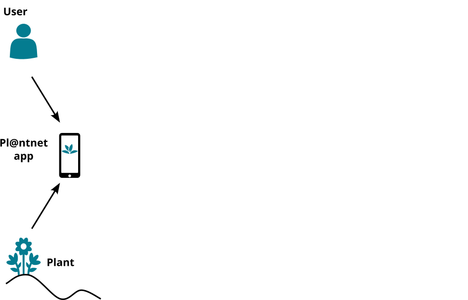{.fragment width=100% fragment-index=2}

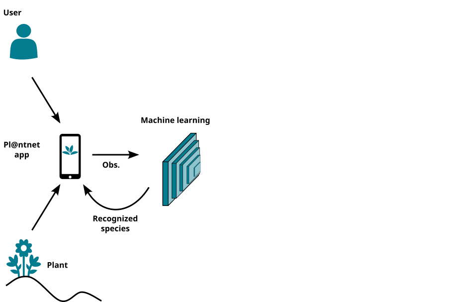{.fragment width=100% fragment-index=3}

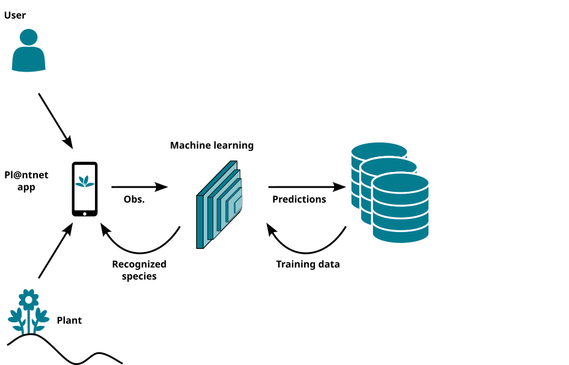{.fragment width=100% fragment-index=4}

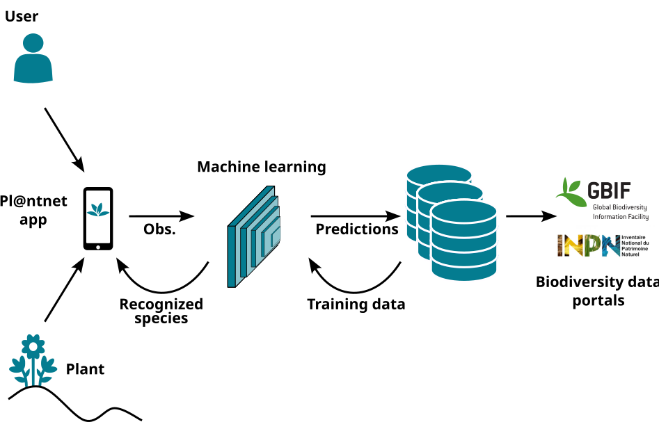{.fragment width=100% fragment-index=5}

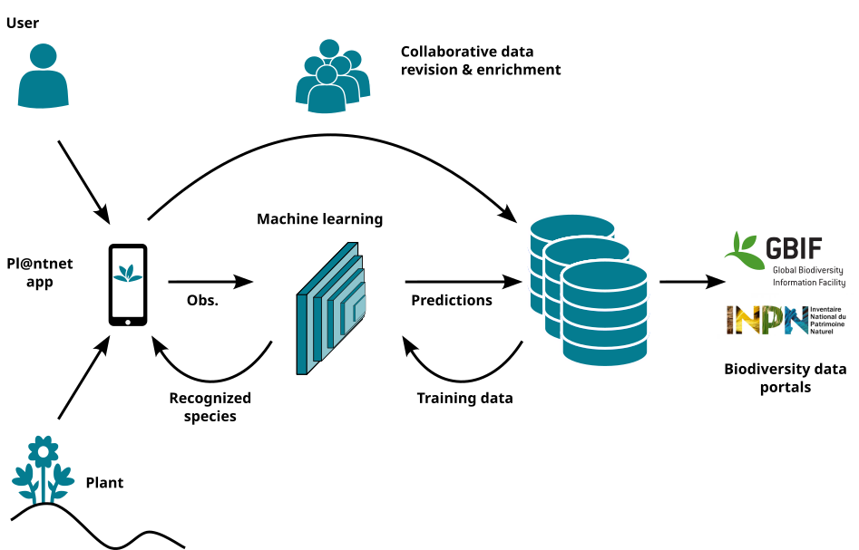{.fragment width=100% fragment-index=6}
<!-- SVG fonts embedding trick -->
<!-- https://lvngd.com/blog/how-embed-google-font-svg/ -->
<!-- https://amio.github.io/embedded-google-fonts/ -->
:::
<!------------------------------------------------------------------------ -->


<!------------------------------------------------------------------------ -->
###  Chronology of Pl@ntNet {.center }
<hr>


<center>
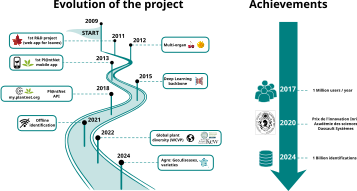
</center>

. . .

<center>

**Note:** I am mostly innocent, I started working with the Pl@ntNet team in 2020

</center>
<!------------------------------------------------------------------------ -->


<!------------------------------------------------------------------------ -->
###  Scientific challenges
<hr>

:::: {.columns style='display: flex !important; gap: 2rem;'}

::: {.column width="50%" style="padding: 0.5rem;"}

**A multidisciplinary collaboration:**

<div style="margin-left: 1em;">

- Stat / ML researchers
- Ecologists
- Engineers
- Citizen contributors

</div>

:::

::: {.column width="50%" style="padding: 0.5rem;"}

**Addressing open challenges:**

<div style="margin-left: 1em;">

- Theoretical foundations
- Methodological advances
- Large-scale computational needs
- Cross-disciplinary integration
</div>


:::
::::


. . .


<center>
{width=23%}

**[We need you]{.underline}**: come and help us improve it, one way or another!

</center>

<!------------------------------------------------------------------------ -->


<!------------------------------------------------------------------------ -->
# Contributions {.section-background}
<!------------------------------------------------------------------------ -->


<!------------------------------------------------------------------------ -->
###  Some personal contributions
<hr>

<br>

:::: {.columns }

::: {.column width="68%"}

- **Pl@ntNet-300K** [@Garcin_Joly_Bonnet_Affouard_Lombardo_Chouet_Servajean_Lorieul_Salmon2021]: **Creation** and **release** of a large-scale dataset sharing the same property (Long Tail!) as Pl@ntNet; available for the community to improve learning systems

:::

::: {.column width="29%"}

<center>

</center>
<br>
:::

::::


::: fragment

:::: columns

::: {.column width="68%"}

- **Prediction uncertainty quantification** with long tail data [@Ding_Fermanian_Salmon25] : providing prediction sets with statistical guarantees with Conformal Prediction

:::

::: {.column width="29%"}
<center>
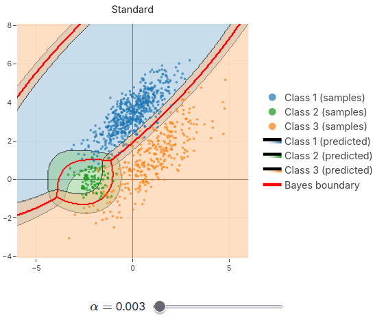
</center>
<br>
:::

::::

:::


::: fragment

:::: columns

::: {.column width="68%"}

- **Learning & crowd-sourced data** [@Lefort_Charlier_Joly_Salmon22] and [@Lefort_etal24]: How to leverage multiple labels per image to improve the model? Need to **assert quality**: the workers, the images/labels, the model, etc.

:::

::: {.column width="29%"}
<center>
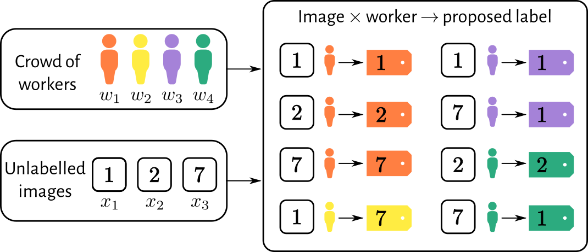
</center>
<br>
:::

::::

:::


<!------------------------------------------------------------------------ -->


<!------------------------------------------------------------------------ -->
# Pl@ntNet data characteristics {.section-background}
<!------------------------------------------------------------------------ -->


<!------------------------------------------------------------------------ -->
###  Plants trivia
<hr>
<br>

```{=html}
<div style="display: flex; gap: 2vw; max-width: 98%; margin: 0 auto; align-items: flex-start; justify-content: center;">

    <div style="height:75%; text-align: center; position: relative;">
        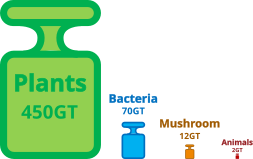
```


<div style="font-size: 0.75em; margin-top: 5px; text-align: center;">Biomass on earth [@bar2018biomass]</div>


```{=html}
    </div>

    <div style="height:75%; text-align: center; position: relative;">
        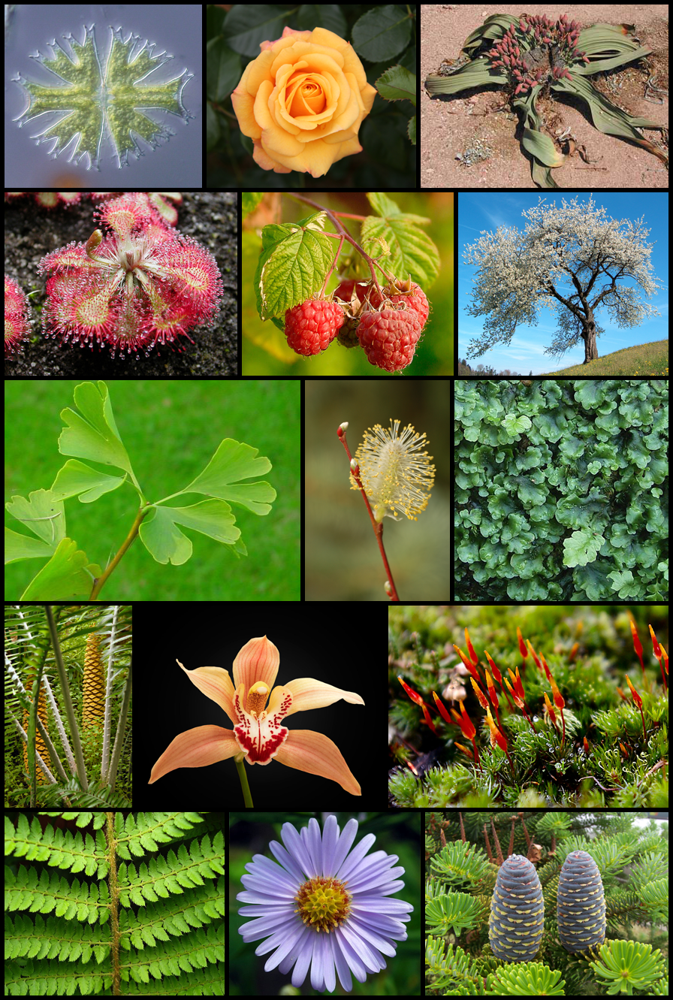
        <span class="img-author-overlay" style="top: 15px;
    right: 15px;">@ Rkitko (Wikimedia Commons)</span>
        <div style="font-size: 0.75em; margin-top: 5px;">Diversity: 400K+ species</div>
    </div>

    <div style="height:75%; text-align: center; position: relative;">
        
        <span class="img-author-overlay">RBG Kew<br>CC-BY-SA</span>
        <div style="font-size: 0.75em; margin-top: 5px;">Angiosperm Tree of Life</div>
    </div>
</div>  
```
<br>

. . .

<center>
**[Consequences]{.underline}**: for supervised learning, the classes are **many** and **hierarchically structured**
</center>
<!------------------------------------------------------------------------ -->


<!------------------------------------------------------------------------ -->
### Intra-class variability


```{=html}
<div class="img-author-group-centered" style="gap:0.7em; align-items:stretch;">
  <div class="img-author-container" style="width:19%; min-width:120px;">
      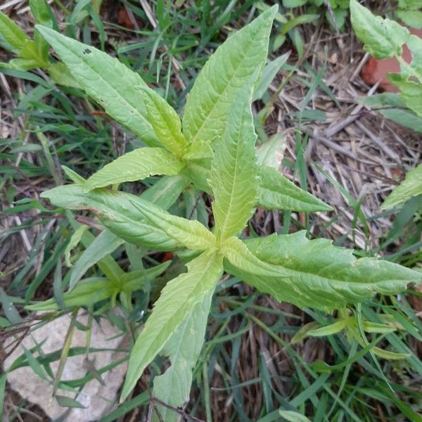
      <span class="img-author-overlay">Benoît Janichon<br>CC-BY-SA</span>
      <span class="img-author-caption"><span style="font-style:italic">Guizotia abyssinica</span> (L.f.) Cass.</span>
  </div>
  <div class="img-author-container" style="width:19%; min-width:120px;">
      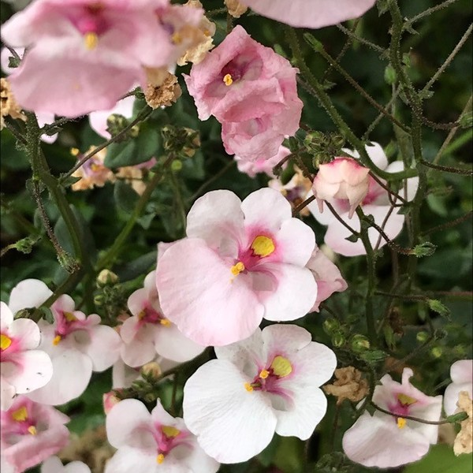
      <span class="img-author-overlay">Patrice SIROT<br>CC-BY-SA</span>
      <span class="img-author-caption"><span style="font-style:italic">Diascia rigescens</span> E.Mey. ex Benth.</span>
  </div>
  <div class="img-author-container" style="width:19%; min-width:120px;">
      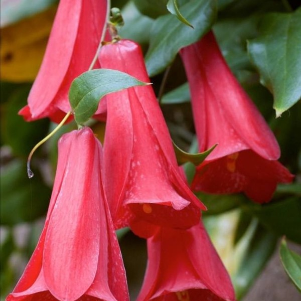
      <span class="img-author-overlay">Borquez Vicent<br>CC-BY-SA</span>
      <span class="img-author-caption"><span style="font-style:italic">Lapageria rosea</span> Ruiz & Pav.</span>
  </div>
  <div class="img-author-container" style="width:19%; min-width:120px;">
      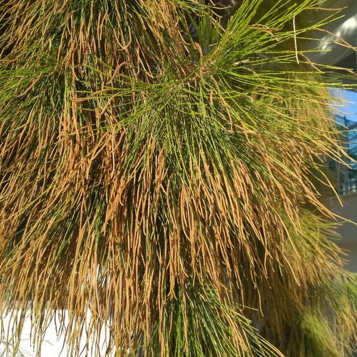
      <span class="img-author-overlay">Наталья<br>CC-BY-SA</span>
      <span class="img-author-caption"><span style="font-style:italic">Casuarina cunninghamiana</span> Miq. LC</span>
  </div>
  <div class="img-author-container" style="width:19%; min-width:120px;">
      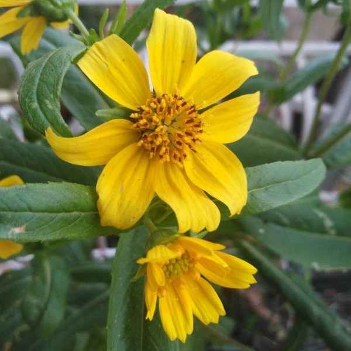
      <span class="img-author-overlay">Annette Bejany<br>CC-BY-SA</span>
      <span class="img-author-caption"><span style="font-style:italic">Guizotia abyssinica</span> (L.f.) Cass.</span>
  </div>
  <div class="img-author-container" style="width:19%; min-width:120px;">
      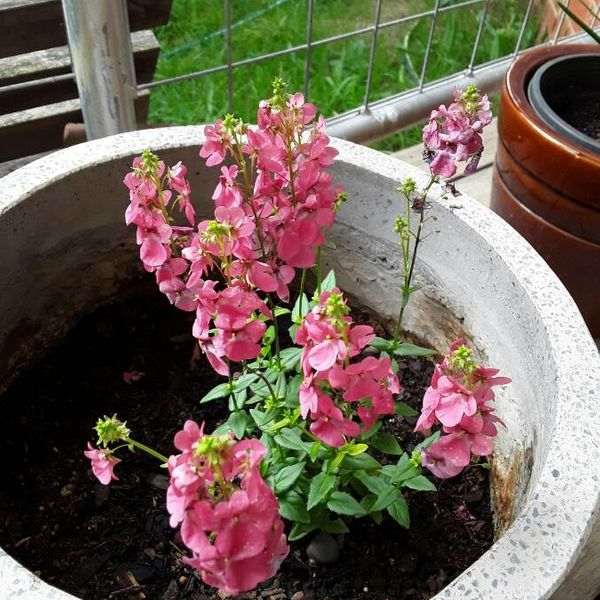
      <span class="img-author-overlay">A Lee<br>CC-BY-SA</span>
      <span class="img-author-caption"><span style="font-style:italic">Diascia rigescens</span> E.Mey. ex Benth.</span>
  </div>
    <div class="img-author-container" style="width:19%; min-width:120px;">
        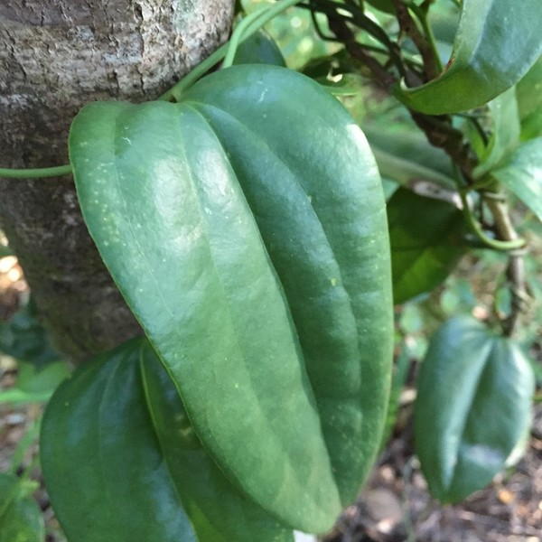
    <span class="img-author-overlay">Daniel Barthelemy<br>CC-BY-SA</span>
    <span class="img-author-caption"><span style="font-style:italic">Lapageria rosea</span> Ruiz & Pav.</span>
    </div>
    <div class="img-author-container" style="width:19%; min-width:120px;">
        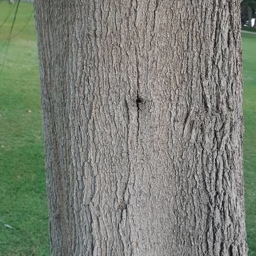
    <span class="img-author-overlay">Campos Ignacio<br>CC-BY-SA</span>
    <span class="img-author-caption"><span style="font-style:italic">Casuarina cunninghamiana</span> Miq. LC</span>
    </div>
</div>
```


<center>
**Based on pictures only, plant species are challenging to discriminate!**
</center>
<!-------------------------------------------------------------------------- -->


### Inter-class ambiguity


```{=html}
<div class="img-author-group-centered" style="gap:0.7em; align-items:stretch;">
  <div class="img-author-container" style="width:19%; min-width:120px;">
    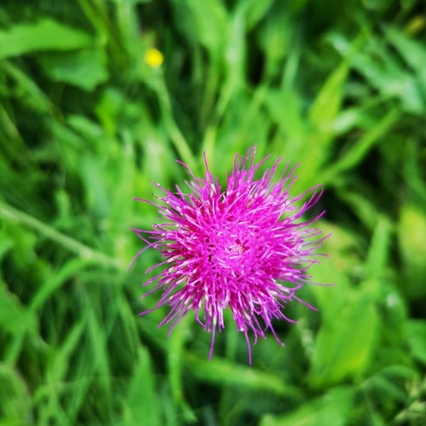
    <span class="img-author-overlay">stefano mazzotti<br>CC-BY-SA</span>
    <span class="img-author-caption"><span style="font-style:italic">Cirsium rivulare</span> (Jacq.) All.</span>
  </div>
  <div class="img-author-container" style="width:19%; min-width:120px;">
    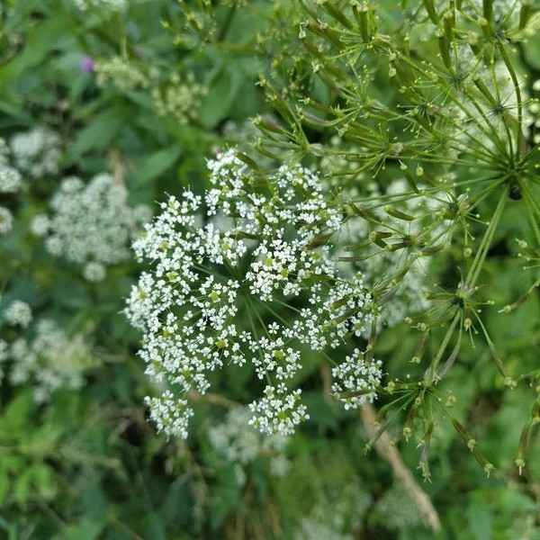
    <span class="img-author-overlay">buqa Jarmil<br>CC-BY-SA</span>
    <span class="img-author-caption"><span style="font-style:italic">Chaerophyllum aromaticum</span> L.</span>
  </div>
  <div class="img-author-container" style="width:19%; min-width:120px;">
    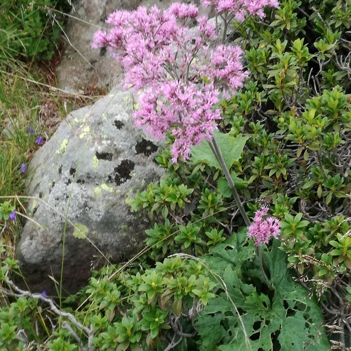
    <span class="img-author-overlay">Walter Reider<br>CC-BY-SA</span>
    <span class="img-author-caption"><span style="font-style:italic">Adenostyles leucophylla</span> Rchb.</span>
  </div>
  <div class="img-author-container" style="width:19%; min-width:120px;">
    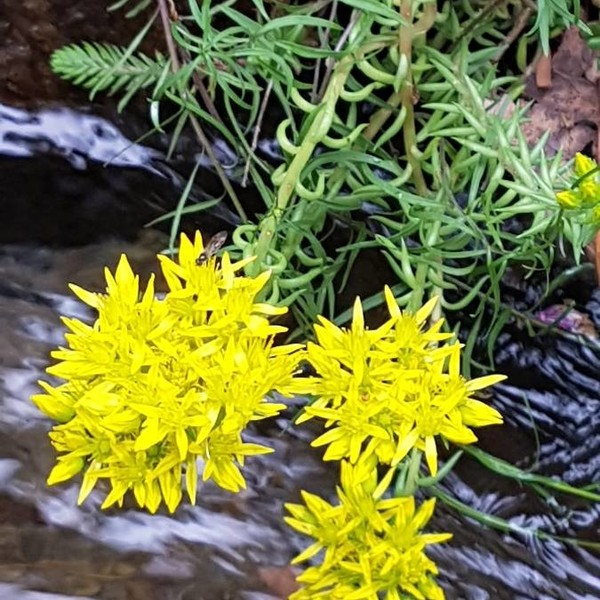
    <span class="img-author-overlay">furs<br>CC-BY-SA</span>
    <span class="img-author-caption"><span style="font-style:italic">Petrosedum montanum</span> (Songeon & E.P.Perrier) Grulich</span>
  </div>
  <div class="img-author-container" style="width:19%; min-width:120px;">
    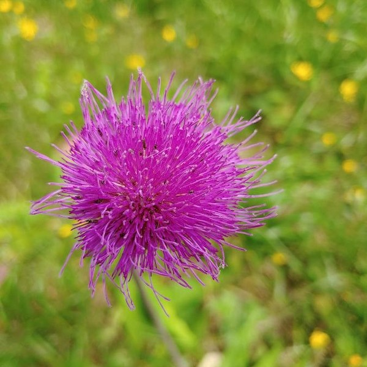
    <span class="img-author-overlay">Rene Weck<br>CC-BY-SA</span>
    <span class="img-author-caption"><span style="font-style:italic">Cirsium tuberosum</span> (L.) All.</span>
  </div>
  <div class="img-author-container" style="width:19%; min-width:120px;">
    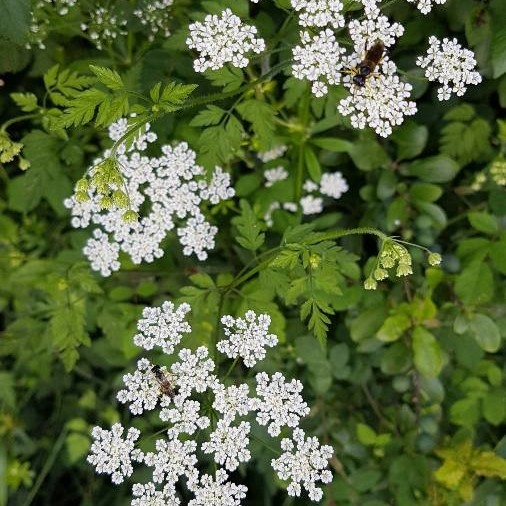
    <span class="img-author-overlay">Jcm Arthur<br>CC-BY-SA</span>
    <span class="img-author-caption"><span style="font-style:italic">Chaerophyllum temulum</span> L.</span>
  </div>
  <div class="img-author-container" style="width:19%; min-width:120px;">
    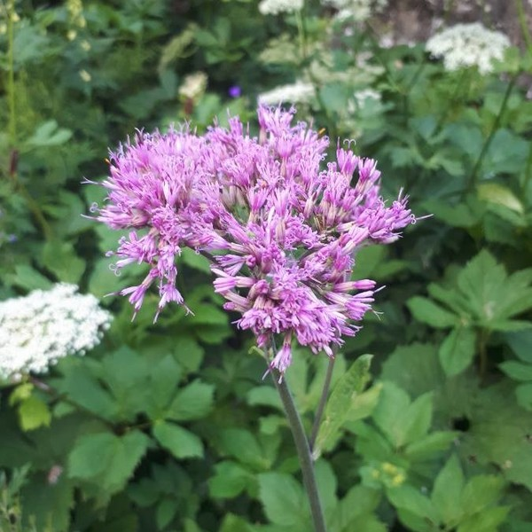
    <span class="img-author-overlay">pierre Lamy<br>CC-BY-SA</span>
    <span class="img-author-caption"><span style="font-style:italic">Adenostyles alpina</span> (L.) Bluff & Fingerh.</span>
  </div>
  <div class="img-author-container" style="width:19%; min-width:120px;">
    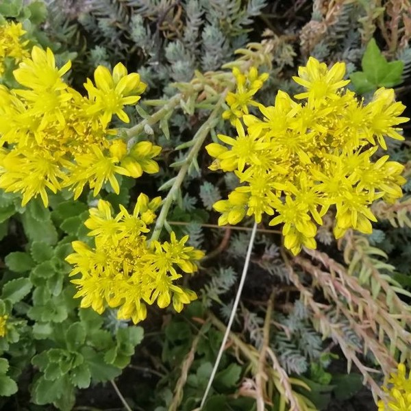
    <span class="img-author-overlay">Wolfi 41<br>CC-BY-SA</span>
    <span class="img-author-caption"><span style="font-style:italic">Petrosedum rupestre</span> (L.) P.V.Heath</span>
  </div>
</div>
```

<center>
**Based on pictures only, plant species are challenging to discriminate!**
</center>
<!-------------------------------------------------------------------------- -->


<!-------------------------------------------------------------------------- -->
## Sampling bias {.section-background-small}
<!-------------------------------------------------------------------------- -->


<!-------------------------------------------------------------------------- -->


###  Geographic bias (Pl@ntNet observations)

<hr>

<link rel="stylesheet" href="https://unpkg.com/leaflet@1.9.4/dist/leaflet.css" />
<script src="https://unpkg.com/leaflet@1.9.4/dist/leaflet.js"></script>
<link rel="stylesheet" href="https://cdn.jsdelivr.net/npm/nouislider@15.7.1/dist/nouislider.min.css">
<script src="https://cdn.jsdelivr.net/npm/nouislider@15.7.1/dist/nouislider.min.js"></script>
<div style="text-align:center; max-width 980px; margin:0 auto;">
<div style="margin-bottom:10px; display:flex; justify-content:center; gap:6px;">
<input type="text" id="citySearch" placeholder="Search a city (e.g. Lyon)" style="padding:6px 10px; width:280px; border:1px solid #ccc; border-radius:4px; font-size:14px;">
<button id="citySearchBtn" style="padding:6px 14px; border:none; background:#4C7BE1; color:#fff; border-radius:4px; font-size:14px; cursor:pointer;">Go</button>
<button id="resetViewBtn" title="Reset view" style="padding:6px 12px; border:1px solid #4C7BE1; background:#fff; color:#4C7BE1; border-radius:4px; font-size:14px; cursor:pointer;">⟲ Reset</button>
</div>
<div id="gbifMap" style="width:100%; height:504px;"></div>
<div style="padding:8px 30px 14px; background:#f2f2f2; border-radius:0 0 6px 6px;">
<div id="yearSlider"></div>
</div>
<div id="citySearchStatus" style="font-size:12px; color:#999; margin-top:4px; min-height:14px;"></div>
</div>
<style>
#yearSlider {
  --slider-scale: 1;
  height: calc(5px * var(--slider-scale));
  margin: calc(20px * var(--slider-scale)) calc(14px * var(--slider-scale));
  background: #e2e2e2;
  border: none;
  border-radius: 3px;
  box-shadow: none;
}
#yearSlider .noUi-connect {
  background: #4C7BE1;
}
#yearSlider .noUi-handle {
  box-sizing: border-box;
  width: calc(24px * var(--slider-scale));
  height: calc(24px * var(--slider-scale));
  border-radius: 50%;
  background: #4C7BE1;
  border: calc(2.5px * var(--slider-scale)) solid #fff;
  box-shadow: 0 2px 5px rgba(0,0,0,0.35);
  top: calc(-10px * var(--slider-scale));
  right: calc(-12px * var(--slider-scale));
  cursor: grab;
  transition: transform 0.15s ease, box-shadow 0.15s ease;
}
#yearSlider .noUi-handle:hover {
  transform: scale(1.1);
  box-shadow: 0 3px 7px rgba(0,0,0,0.45);
}
#yearSlider .noUi-handle:active {
  cursor: grabbing;
  transform: scale(1.15);
}
#yearSlider .noUi-handle::before {
  content: "";
  box-sizing: border-box;
  display: block;
  position: absolute;
  top: 50%;
  left: 50%;
  width: calc(7px * var(--slider-scale));
  height: calc(7px * var(--slider-scale));
  background: #fff;
  border-radius: 50%;
  transform: translate(-50%, -50%);
}
#yearSlider .noUi-handle::after {
  display: none;
}
#yearSlider .noUi-tooltip {
  box-sizing: border-box;
  position: absolute;
  left: 50%;
  transform: translate(-50%, 0);
  display: flex;
  align-items: center;
  justify-content: center;
  min-height: calc(21px * var(--slider-scale));
  padding: 0 calc(9px * var(--slider-scale));
  line-height: 1;
  font-size: calc(10.5px * var(--slider-scale));
  font-weight: 700;
  background: #4C7BE1;
  color: #fff;
  border: none;
  border-radius: 5px;
  top: calc(22px * var(--slider-scale));
  white-space: nowrap;
}
#resetViewBtn:hover {
  background: #4C7BE1;
  color: #fff;
}
</style>
<script>
(function() {
  const publishingOrg = 'da86174a-a605-43a4-a5e8-53d484152cd3';
  const minYear = 2000;
  const maxYear = 2026;

  const DEFAULT_CENTER = [10, 15];
  const DEFAULT_ZOOM = 2;

  function gbifTileUrl(year) {
    return `https://api.gbif.org/v2/map/occurrence/density/{z}/{x}/{y}@2x.png?style=classic-noborder.poly&bin=hex&hexPerTile=100&publishingOrg=${publishingOrg}&year=,${year}`;
  }

  // Latitude still clamped to standard Web Mercator limits (no undefined polar tiles).
  // Longitude left unbounded so tiles can wrap horizontally and fill the container
  // (removes the grey side gaps that appeared with a hard longitude limit).
  const MERCATOR_LAT_LIMIT = 85.0511;
  const southWest = L.latLng(-MERCATOR_LAT_LIMIT, -Infinity);
  const northEast = L.latLng(MERCATOR_LAT_LIMIT, Infinity);
  const mercatorBounds = L.latLngBounds(southWest, northEast);

  const map = L.map('gbifMap', {
    center: DEFAULT_CENTER,
    zoom: DEFAULT_ZOOM,
    minZoom: 2,
    maxBounds: mercatorBounds,
    maxBoundsViscosity: 1.0,
    worldCopyJump: true
  });

  L.tileLayer('https://server.arcgisonline.com/ArcGIS/rest/services/World_Imagery/MapServer/tile/{z}/{y}/{x}', {
    attribution: 'Tiles © Esri, Maxar, Earthstar Geographics'
  }).addTo(map);

  let occurrenceLayer = L.tileLayer(gbifTileUrl(maxYear), {
    attribution: 'Occurrence data © GBIF'
  }).addTo(map);

  const sliderEl = document.getElementById('yearSlider');

  noUiSlider.create(sliderEl, {
    start: [maxYear],
    connect: [true, false],
    range: { min: minYear, max: maxYear },
    step: 1,
    tooltips: true,
    format: {
      to: v => Math.round(v),
      from: v => Number(v)
    }
  });

  sliderEl.noUiSlider.on('update', function(values) {
    const year = values[0];
    map.removeLayer(occurrenceLayer);
    occurrenceLayer = L.tileLayer(gbifTileUrl(year)).addTo(map);
  });

  function fixMapSize() {
    map.invalidateSize();
  }

  if (window.Reveal) {
    Reveal.on('slidechanged', fixMapSize);
    Reveal.on('ready', fixMapSize);
  }
  setTimeout(fixMapSize, 300);
  setTimeout(fixMapSize, 1000);

  const searchInput = document.getElementById('citySearch');
  const searchBtn = document.getElementById('citySearchBtn');
  const statusEl = document.getElementById('citySearchStatus');
  const resetBtn = document.getElementById('resetViewBtn');
  let searchMarker = null;

  async function searchCity() {
    const query = searchInput.value.trim();
    if (!query) return;

    statusEl.textContent = 'Searching...';
    try {
      const url = `https://nominatim.openstreetmap.org/search?format=json&limit=1&q=${encodeURIComponent(query)}`;
      const resp = await fetch(url, {
        headers: { 'Accept': 'application/json' }
      });
      const results = await resp.json();

      if (!results || results.length === 0) {
        statusEl.textContent = `No location found for "${query}"`;
        return;
      }

      const { lat, lon, display_name } = results[0];
      map.setView([parseFloat(lat), parseFloat(lon)], 12);

      if (searchMarker) map.removeLayer(searchMarker);
      searchMarker = L.marker([parseFloat(lat), parseFloat(lon)]).addTo(map);

      statusEl.textContent = display_name;
    } catch (err) {
      statusEl.textContent = 'Search failed — check your connection.';
      console.error('Geocoding error:', err);
    }
  }

  function resetView() {
    map.setView(DEFAULT_CENTER, DEFAULT_ZOOM);
    if (searchMarker) {
      map.removeLayer(searchMarker);
      searchMarker = null;
    }
    searchInput.value = '';
    statusEl.textContent = '';
  }

  searchBtn.addEventListener('click', searchCity);
  searchInput.addEventListener('keydown', (e) => {
    if (e.key === 'Enter') searchCity();
  });
  resetBtn.addEventListener('click', resetView);
})();
</script>

<!-- ###  Geographic bias


<div style="display: flex; flex-direction: column;">
<center>
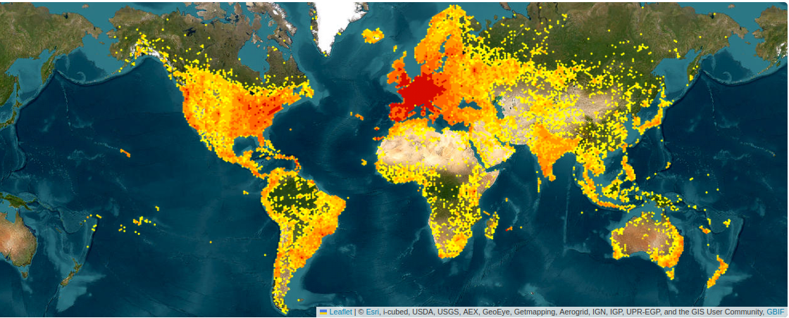

Spatial density of images collected by Pl@ntNet (13/04/2024)
</center>
</div> -->
<!-------------------------------------------------------------------------- -->


###  Food bias
<hr>

<br>
<center>
Top-5 most observed plant species in Pl@ntNet (13/04/2024):
</center>

<br>


```{=html}
<div class="img-author-group-centered">
      <div class="img-author-container" style="width:19%; min-width:120px;">
        <div style="text-align:center; font-size:1.2em; color:#222; margin-bottom:6px; font-family: Nunito, Arial, sans-serif; font-weight:bold;">25134 obs.</div>
        <div style="position:relative; width:100%;">
            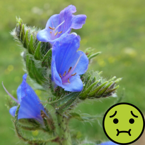
            <span class="img-author-overlay">Llandrich anna<br>CC-BY-SA</span>
        </div>
        <span class="img-author-caption"><span style="font-style:italic">Echium vulgare</span> L.</span>
    </div>
      <div class="img-author-container" style="width:19%; min-width:120px;">
        <div style="text-align:center; font-size:1.2em; color:#222; margin-bottom:6px; font-family: Nunito, Arial, sans-serif; font-weight:bold;">24720 obs.</div>
        <div style="position:relative; width:100%;">
            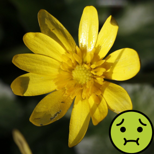
            <span class="img-author-overlay">JYCO<br>CC-BY-SA</span>
        </div>
        <span class="img-author-caption"><span style="font-style:italic">Ranunculus ficaria</span> L.</span>
    </div>
      <div class="img-author-container" style="width:19%; min-width:120px;">
        <div style="text-align:center; font-size:1.2em; color:#222; margin-bottom:6px; font-family: Nunito, Arial, sans-serif; font-weight:bold;">24103 obs.</div>
        <div style="position:relative; width:100%;">
            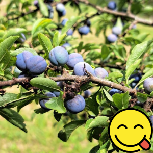
            <span class="img-author-overlay">fuerst.ernst<br>CC-BY-SA</span>
        </div>
        <span class="img-author-caption"><span style="font-style:italic">Prunus spinosa</span> L.</span>
    </div>
      <div class="img-author-container" style="width:19%; min-width:120px;">
        <div style="text-align:center; font-size:1.2em; color:#222; margin-bottom:6px; font-family: Nunito, Arial, sans-serif; font-weight:bold;">23288 obs.</div>
        <div style="position:relative; width:100%;">
            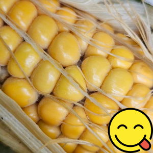
            <span class="img-author-overlay">Uta Groger<br>CC-BY-SA</span>
        </div>
        <span class="img-author-caption"><span style="font-style:italic">Zea mays</span> L.</span>
    </div>
      <div class="img-author-container" style="width:19%; min-width:120px;">
        <div style="text-align:center; font-size:1.2em; color:#222; margin-bottom:6px; font-family: Nunito, Arial, sans-serif; font-weight:bold;">23075 obs.</div>
        <div style="position:relative; width:100%;">
            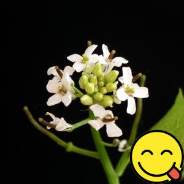
            <span class="img-author-overlay">Pascal Ollagnier<br>CC-BY-SA</span>
        </div>
        <span class="img-author-caption"><span style="font-style:italic">Alliaria petiolata</span> (M.Bieb.) Cavara &amp; Grande</span>
    </div>
</div>
```
<!----------------------------------------------------------------------- -->


<!----------------------------------------------------------------------- -->
###  Beauty bias
<hr>


```{=html}
<div class="img-author-group-centered">
      <div class="img-author-container" style="width:40%; min-width:120px;">
        <div style="text-align:center; font-size:1.2em; color:#222; margin-bottom:6px; font-family: Nunito, Arial, sans-serif; font-weight:bold;">10753 obs.</div>
        <div style="position:relative; width:100%;">
            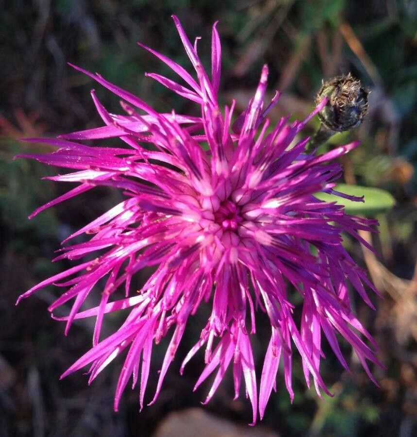
            <span class="img-author-overlay">Dieter Wagner<br>CC-BY-SA</span>
        </div>
        <span class="img-author-caption"><span style="font-style:italic">Centaurea jacea</span> L.</span>
    </div>
      <div class="img-author-container" style="width:40%; min-width:120px;">
        <div style="text-align:center; font-size:1.2em; color:#222; margin-bottom:6px; font-family: Nunito, Arial, sans-serif; font-weight:bold;">6 obs.</div>
        <div style="position:relative; width:100%;">
            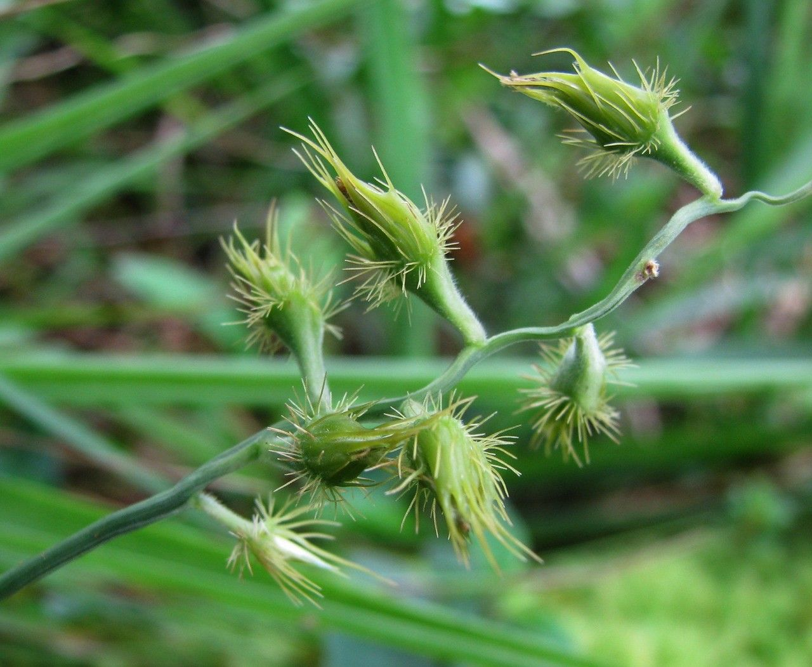
            <span class="img-author-overlay">David Eickhoff − EOL<br>CC-BY-SA </span>
        </div>
        <span class="img-author-caption"><span style="font-style:italic">Cenchrus agrimonioides</span> Trin.</span>
    </div>
</div>
```
<!----------------------------------------------------------------------- -->


<!-------------------------------------------------------------------------- -->
###  Size bias
<hr>


```{=html}
<div class="img-author-group-centered" style="gap:4em; align-items:stretch;">
    <div class="img-author-container" style="width:30%; min-width:120px;">
        <div style="text-align:center; font-size:1.2em; color:#222; margin-bottom:6px; font-family: Nunito, Arial, sans-serif; font-weight:bold;">8376 obs.</div>
        <div style="position:relative; width:100%;">
            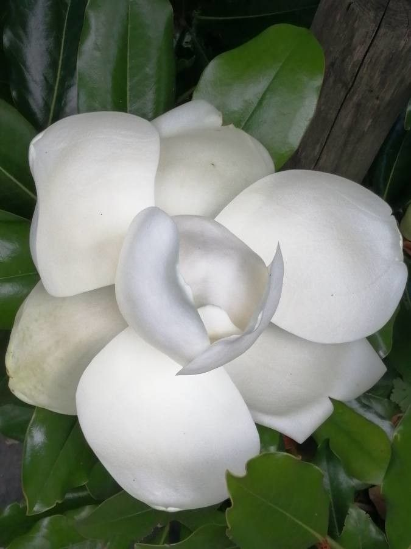
            <span class="img-author-overlay">Patrick Cartier<br>CC-BY-SA</span>
        </div>
        <span class="img-author-caption"><span style="font-style:italic">Magnolia grandiflora</span> L.</span>
    </div>
    <div style="width:8%; min-width:60px; display:flex; align-items:center; justify-content:center; flex-direction:column;">
        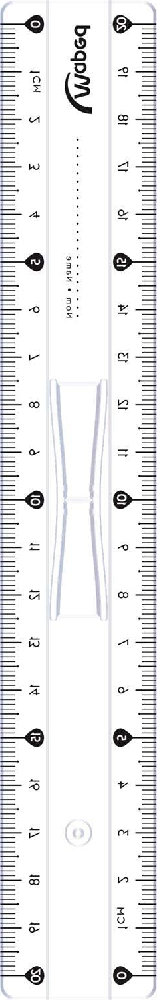
    </div>
    <div class="img-author-container" style="width:30%; min-width:120px;">
        <div style="text-align:center; font-size:1.2em; color:#222; margin-bottom:6px; font-family: Nunito, Arial, sans-serif; font-weight:bold;">413 obs.</div>
        <div style="position:relative; width:100%;">
            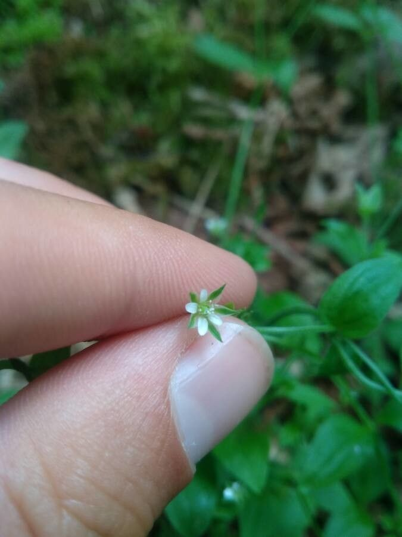
            <span class="img-author-overlay">Maximilien Perrin<br>CC-BY-SA</span>
        </div>
        <span class="img-author-caption"><span style="font-style:italic">Moehringia trinervia</span> (L.) Clairv.</span>
    </div>
</div>
```
<!-------------------------------------------------------------------------- -->


<!-------------------------------------------------------------------------- -->
###  More biases ... shaping the dataset
<hr>


::: {.biases-grid}

::: {.bias-card}



#### Selection bias

What gets photographed is not random.

`Easy access`

 `Visible species`

 `Easy identification`

:::

::: {.bias-card}



#### Temporal bias

What we see depends on **when** we look.

`Season`

 `Flowering`

 `Plant appearance`

:::

::: {.bias-card}



#### Subjective bias

Observations can reflect observers own choices.

`Personal preferences`

`Rare species`

 `Endangered species`

:::

:::

<center>

<big>...</big>

<br>

<span style="font-size: 2.2em;"> 
</span>  **<span style="font-size: 1.2em;"> more observations ≠ a more representative dataset</span>**
<span style="font-size: 2.2em;"> 
</span>
</center>

<!-------------------------------------------------------------------------- -->
<!-- ### Many more biases ...
<hr>

<br>

- Selection bias
    - Convenience sampling: **easily** vs. *hardly* accessible
    - Preference for certain species: **visibility** / **ease of identification**
    - Subjective bias: selection based on **personal judgment**, may not be random or representative
     - Rare species: **rare** or **endangered** species may be under-represented

- Temporal bias / seasonal variation: **seasonal changes** in plant characteristics
- ... -->


<!-------------------------------------------------------------------------- -->

<!-------------------------------------------------------------------------- -->
## The Pl@ntNet-300K dataset {.section-background-small}
<!-------------------------------------------------------------------------- -->


<!-------------------------------------------------------------------------- -->
### Datafication & data sharing
<hr>

::: {.columns}

::: {.column width="63%"}

<br>

**Popular [labeled]{.underline} datasets limitations:**

<div style="margin-left: 1em;">

- structure of labels too simplistic (CIFAR-10, CIFAR-100)
- tasks too easy to discriminate / low labels confusion (MNIST)
- too well-balanced, same number of images per class (Imagenet)
- duplicate, low-quality, irrelevant images [@recht2019imagenet]

</div>

:::

::: {.column width="37%"}

<div style="position:relative; width:100%; height:350px;">

::: {.fragment .fade-in-then-out}
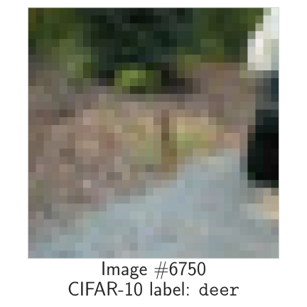
:::

::: {.fragment .fade-in-then-out}
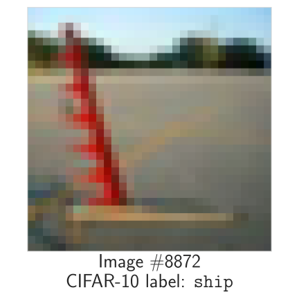
:::

::: {.fragment .fade-in-then-out}
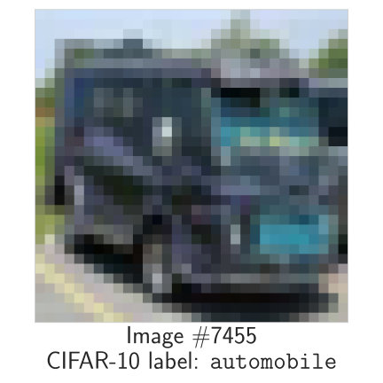
:::

::: {.fragment}
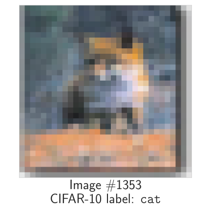
:::


</div>

:::

:::

. . .


<br>

**<span style="display: inline-block; transform: rotate(-180deg);"></span> Pl@ntNet-300K:**  a curated, shareable subset of Pl@ntNet for **[frictionless reproducibility]{.underline}** [@donoho2024data]

<div style="margin-left: 1em;">

- **Advance plant identification research** with real-world biodiversity data
- **Engage the ML community** with meaningful challenges beyond synthetic benchmarks
</div>

<!-- ***"The collective behavior induced by frictionless research exchange is the emergent superpower driving many events that are so striking today."*** [@donoho2024data] -->
<!------------------------------------------------------------------------ -->


<!-------------------------------------------------------------------------- -->
### Construction of Pl@ntNet-300K

<br>

<br>

::: {.columns}


::: {.column width=70%}

<br>

**[Constraints]{.underline}**:


<div style="margin-left: 1em;">

- Extract images from **South-Western Europe** (SWE): most covered regions
- Provide 300 000 images
- Shareable (size < **50Go** for Zenodo)
- Need  **> 4 samples** per class for train/val/test split
- Curated images / labels (well, really?)

</div>

:::

::: {.column width=30%}

<center>
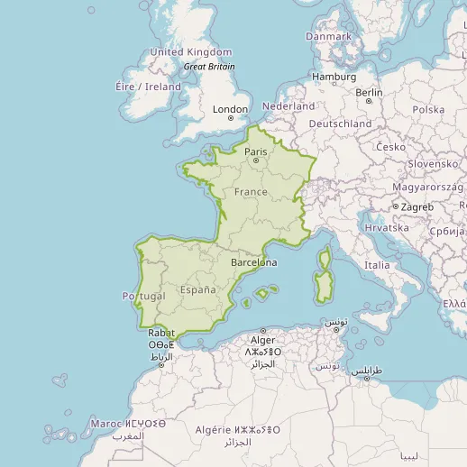{width=90%}
</center>

:::

:::


<!-------------------------------------------------------------------------- -->

```{python}
#| echo: false
import os

required_files = [
    "images/lorenz_full_plantnet.svg",
    "images/lorenz_full_plantnet_cifar_imagenet.svg",
    "images/lorenz_full_plantnet_subsamples.svg",
    "images/lorenz_full_plantnet_subsamples_pn300k.svg",
    "images/lorenz_pn300k.svg"
]

if not all(os.path.exists(f) for f in required_files):
    exec(open('lorentz_curve.py').read())
```

<!-------------------------------------------------------------------------- -->
###  Species distribution, long tail & Lorenz curve
<hr>

:::: {.columns style='display: flex !important'}

::: {.column width=88%}

::: {.r-stack}
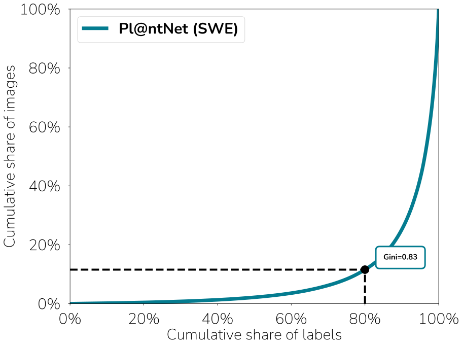{.fragment width=97% fragment-index=1}

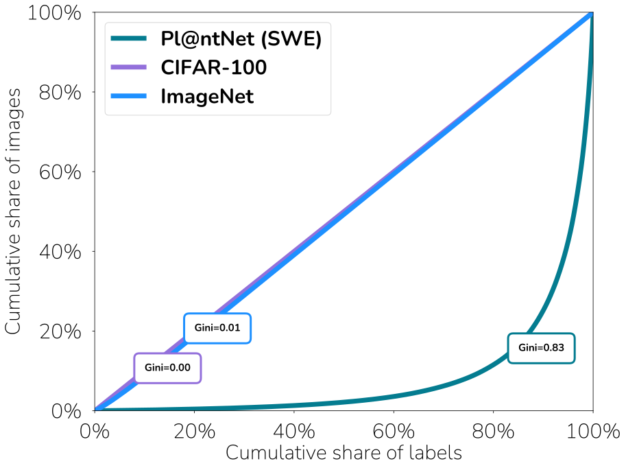{.fragment width=97% fragment-index=2}

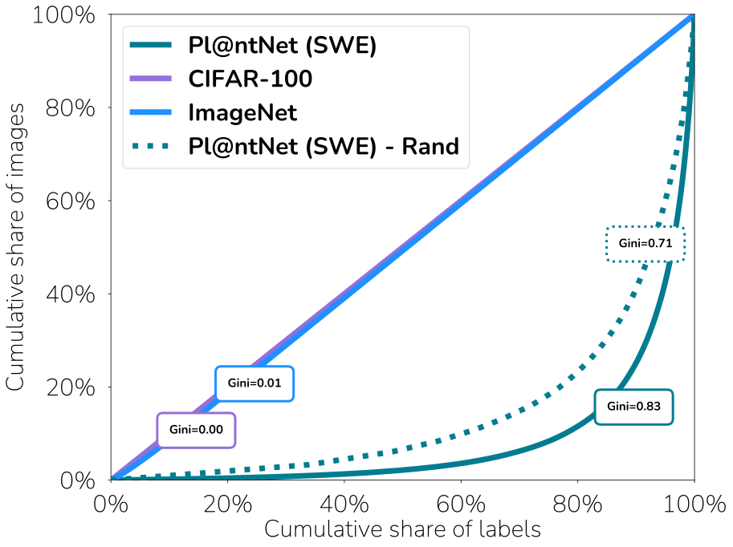{.fragment width=97% fragment-index=3}

:::
:::{.fragment .fade-in-then-out fragment-index=1}

<center>
**80% species | 10% images** $\iff$ **20% species | 90% images**
</center>

:::


:::


::: {.column style='text-align: center;'}

<br>

<ul>
  <li class="fragment" data-fragment-index="1">**Pl@ntNet (SWE)**: has a very long tail</li>
  <li class="fragment" data-fragment-index="2">**CIFAR-100**: balanced</li>
  <li class="fragment" data-fragment-index="2">**ImageNet**: (approx.) balanced</li>
    <li class="fragment" data-fragment-index="3">**Pl@ntNet (SWE) - Rand**: subsampling images uniformly from  Pl@ntNet (SWE) distorts the distribution</li>
</ul>

:::

::::


<!-------------------------------------------------------------------------- -->


<!-------------------------------------------------------------------------- -->
### Taxonomy detour: the tree of life

<br>
<br>

<center>
::: {.r-stack}

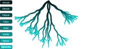{.fragment fragment-index=1 width="1400"}

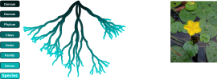{.fragment fragment-index=2 width="1400"}

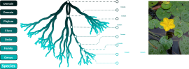{.fragment fragment-index=3 width="1400"} 

:::

</center>

<!-------------------------------------------------------------------------- -->


<!-- 
### Taxonomy detour {style="text-align: center;"}

<!-- 
Domain: Eukaryota
Kingdom: Plantae
Phylum: Tracheophyta
Class: Magnoliopsida
Order: Asterales
Family: Menyanthaceae
Genus: Nymphoides
Species: Nymphoides peltata (S.G.Gmel.) Kuntze


 -->
 


<!-- 
<a href="https://commons.wikimedia.org/wiki/File:Biological_classification_L_Pengo_vflip.svg">Peter Halasz. (User:Pengo)</a>, Public domain, via Wikimedia Commons -->


<!-------------------------------------------------------------------------- -->
### Hierarchical construction of Pl@ntNet-300K {style="text-align: center;"}


<center>

::: {.r-stack}

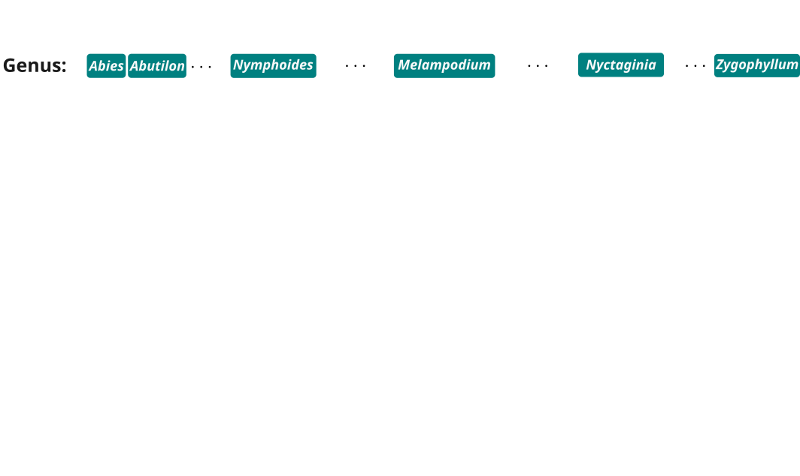{.fragment width=75% fragment-index=1}

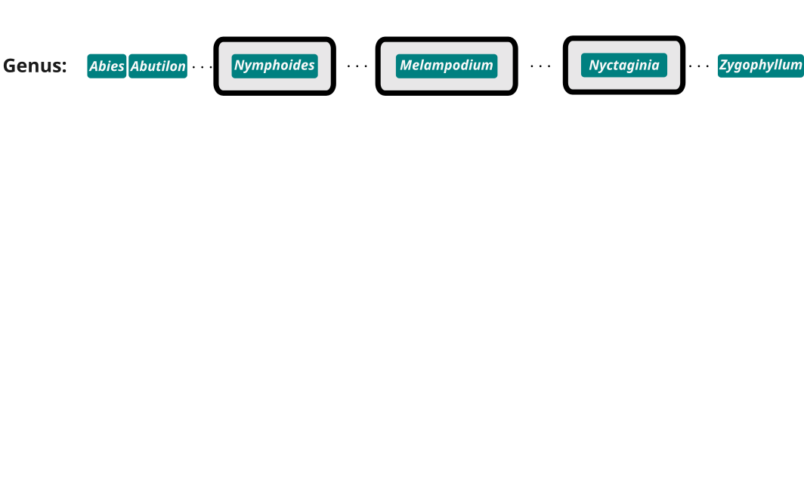{.fragment width=75% fragment-index=2}

{.fragment width=75% fragment-index=3}
:::


<ul>
  <li class="fragment" data-fragment-index="1">Sample at genus level (10%) from all genera present in Pl@ntNet-300k</li>
  <li class="fragment" data-fragment-index="3">Collect all images of such genera from Pl@ntNet (SWE)</li>
</ul>


</center>
<!-------------------------------------------------------------------------- -->


###  Species distribution, long tail & Lorenz curve
<hr>

:::: {.columns style='display: flex !important'}

::: {.column width=88%}

::: {.r-stack}
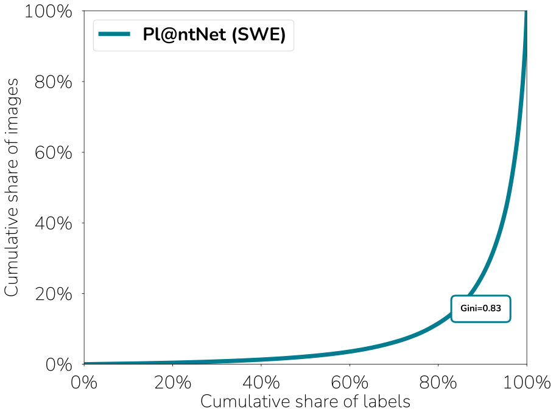{.fragment width=97% fragment-index=1}

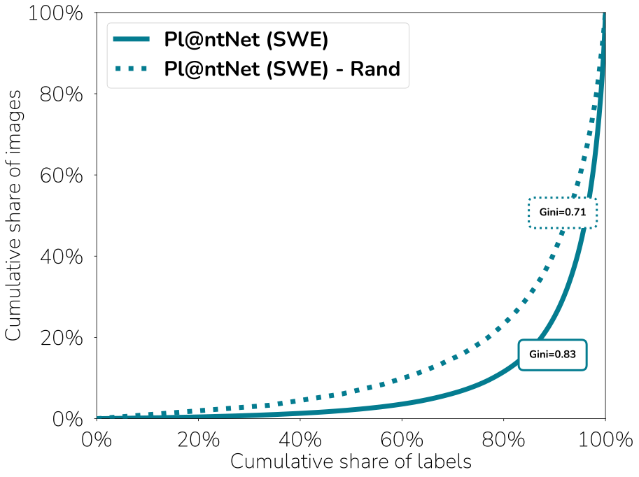{.fragment width=97% fragment-index=2}

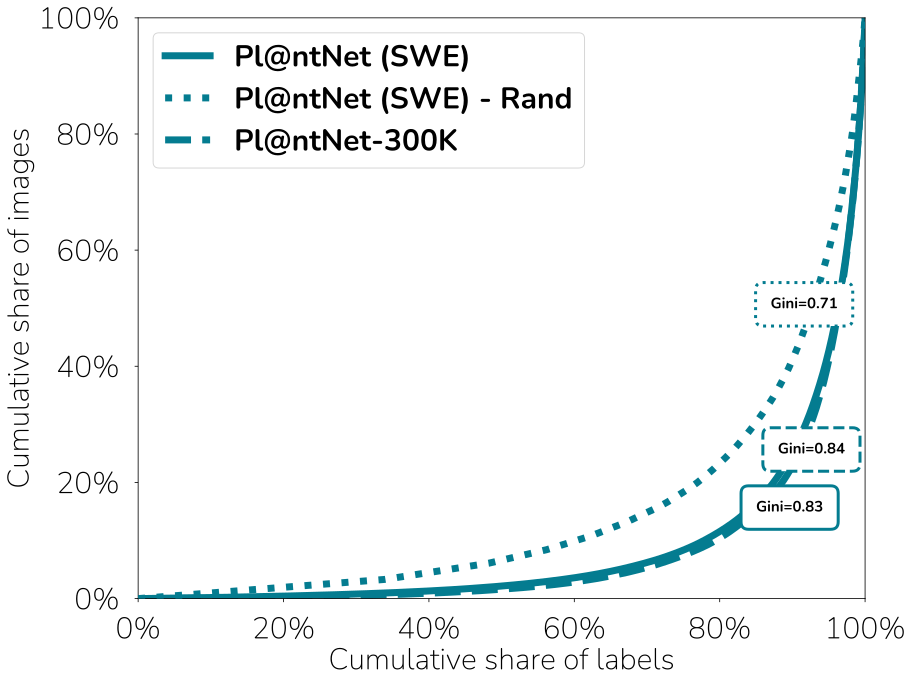{.fragment width=97% fragment-index=3}

:::
:::{.fragment .fade-in-then-out fragment-index=1}

:::


:::


::: {.column style='text-align: center;'}

<br>

<ul>
  <li class="fragment" data-fragment-index="1">**Pl@ntNet (SWE)**: has a very long tail</li>
   <li class="fragment" data-fragment-index="2">**Pl@ntNet (SWE) - Rand**: subsampling images uniformly from  Pl@ntNet (SWE) distorts the distribution</li>
  <li class="fragment" data-fragment-index="3">**PlantNet-300K**: long tail preserved by genera subsampling
</li>

</ul>

:::


:::{.fragment fragment-index=3}
:::


:::
<!-------------------------------------------------------------------------- -->


<!-------------------------------------------------------------------------- -->
### Pl@ntNet-300K: Long tail visualization
<hr>
<br>


```{=html}
<link rel="preconnect" href="https://fonts.googleapis.com">
<link rel="preconnect" href="https://fonts.gstatic.com" crossorigin>
<link href="https://fonts.googleapis.com/css2?family=Nunito:wght@400;700;800&display=swap" rel="stylesheet">

<style>
#plantnet-viz,
#plantnet-viz * {
  font-family: 'Nunito', sans-serif !important;
}

/* Buttons, the image caption, and anything meant to stand out use bold */
#plantnet-viz .scale-btn,
#plantnet-viz .scale-label,
#plantnet-viz #image-label,
#plantnet-viz #plotly-container .js-plotly-plot .legendtext,
#plantnet-viz #plotly-container .js-plotly-plot .xtitle,
#plantnet-viz #plotly-container .js-plotly-plot .ytitle {
  font-weight: 700 !important;
}
</style>

<div style="text-align: center;">

<div style="width:98%; margin: 0 auto;">

<!-- Custom styles to compact the PlantNet filter menu for slides -->

<div id="plantnet-viz" style="max-width: 1200px; margin: 0 auto;">

  <div id="filter-container" style="margin-bottom: 20px;"></div>

  <!-- Main content area with side-by-side layout -->
  <div style="display: flex; flex-direction: row; align-items: flex-start; gap: 20px;">
  <!-- Plot container on the left (wider and shorter) -->
  <div id="plotly-container" style="flex: 4; height: 400px; width: 65vw; max-width: 65vw; min-width: 200px;"></div>

    <!-- Right sidebar with controls and image preview -->
    <div style="flex: 1; min-width: 280px; display: flex; flex-direction: column;">
      <!-- Controls for plot options (moved to align with plot head) -->
      <div style="display: flex; justify-content: flex-end; margin-bottom: 15px;">
        <div class="scale-toggle">
          <span class="scale-label">Y-Scale:</span>
          <button type="button" id="log-scale-btn" class="scale-btn"
            onclick="window.setScale('log'); return false;">Log</button>
          <button type="button" id="linear-scale-btn" class="scale-btn active"
            onclick="window.setScale('linear'); return false;">Linear</button>
        </div>
      </div>

      <!-- Image preview container -->
      <div id="image-preview-container" style="display: flex; flex-direction: column; justify-content: flex-start; align-items: center; flex: 1;">
        <div style="margin-bottom: 10px;">Species Preview</div>
        
        <div id="image-label" style="font-weight: bold; font-size: 8px; min-height: 3.5em; margin-top: 10px; text-align: center; width: 100%; line-height: 1.2;"></div>
      </div>
    </div>
  </div>
</div>

<script type="module" src="../../../../blog/long-tail/plantnet_viz.js"></script>

</div>
</div>

```

<!-------------------------------------------------------------------------- -->


<!-------------------------------------------------------------------------- -->
###  Details on Pl@ntNet-300K
<hr>
<br>

** Goal:**
Provide a real life scenario for supervised learning, with multi-class and long-tail label distribution

<br>


:::: {.columns style='display: flex !important'}

::: {.column }


[**Pl@ntNet-300K v1.0 characteristics**]{.underline}:


<br>

- **306,146** color images
- Size: **32 GB**
- Labels: **1 000+** species
- Required **2 000 000** volunteers
:::


::: {.column width=55%}
:::{.fragment}


<center>

**Neurips (Datasets and Benchmarks track) paper**

[@Garcin_Joly_Bonnet_Affouard_Lombardo_Chouet_Servajean_Lorieul_Salmon2021]

<br>

**Zenodo, 1 click download**

[https://zenodo.org/record/5645731](https://zenodo.org/record/5645731)

<br>

**Code to train models**

[https://github.com/plantnet/PlantNet-300K](https://github.com/plantnet/PlantNet-300K)
</center>

:::

:::

::::


. . .

<br>

<center>
<b>2026 Update: [Pl@ntNet-300K v2.0](https://zenodo.org/records/10419064) on Zenodo </b> 
</center>


<!-- {width=100%} -->

<!-- More details on my blog post:  [https://josephsalmon.eu/blog/long-tail/](https://josephsalmon.eu/blog/long-tail/) -->


<!-------------------------------------------------------------------------- -->


<!-------------------------------------------------------------------------- -->
# Prediction<br>&<br>uncertainty quantification {.section-background}
<!-------------------------------------------------------------------------- -->


<!-------------------------------------------------------------------------- -->
###  Joint work with
<hr>

<center>

:::: {.columns}

::: {.column width="34%"}

<div style="text-align: center;">


**Tiffany Ding**

UC Berkeley

</div>

:::

::: {.column width="22%"}

<div style="text-align: center;">

within

{width=96%}

</div>
:::

::: {.column width="34%"}

<div style="text-align: center;">


**Jean-Baptiste Fermanian**

Inria

</div>

:::

::::

<br>
<br>


"***Conformal Prediction for Long-Tailed Classification***"

T. Ding, J.-B. Fermanian and J. Salmon

ICLR 2026

</center>

<!-------------------------------------------------------------------------- -->


<!-------------------------------------------------------------------------- -->
### Pl@ntNet: set prediction (recommendation)
<hr>

<br>

::::{.columns}
::: {.column width="58%"}
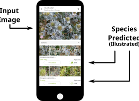{width=90%}
:::

::: {.column width="42%"}

Elements to help guide the users

- provide a set of possible species/labels
- display similar images from proposed species
- give a score of confidence

:::
::::
<!-------------------------------------------------------------------------- -->


<!-------------------------------------------------------------------------- -->
###   (Split) Conformal Prediction [@vovk2005algorithmic]
<hr>

<br>
** Goal:**

For an input image $X$, propose the most probable classes $y$ with **confidence level** $1-\alpha$ (with small $\alpha$)

<br>
<br>

. . .

** Main idea:** Return classes with predicted **score** above a threshold:

$$
\mathcal{C}_{\alpha}(X) = \big\{ y : s(X,y) \geq t_\alpha \big\}
$$


 **In classification**: a common conformal score is $s(x,y) = \hat{p}(y|x)$ (*e.g.,* softmax score from a classifier fitted on a train/validation set).

<br>
<br>

. . .

** Key assumption:** The data calibration $(X_i, Y_i)$ are **exchangeable** with the tested points.
<br>
<br>

. . .


**Conformal prediction**: sets $t_{\alpha}$ as the $(1-\alpha)$ quantile of the scores on a calibration set 


<!-------------------------------------------------------------------------- -->


<!-------------------------------------------------------------------------- -->
###  Optimal sets [@sadinle2019least]
<hr>

:::: {.columns}

::: {.column width="48%"}

**Marginal coverage** targets:

$$\mathbb{P}\big[ Y \in \mathcal{C}_{\alpha}(X) \big ] \geq 1 - \alpha.$$

:::

::: {.column width="48%"}

::: {.fragment}

**Class conditional coverage** targets:

$$\forall y,\quad  \mathbb{P}\big[ Y \in \mathcal{C}_\alpha(X) | Y=y \big ] \geq 1 - \alpha.$$

:::

:::

::::

::: {.fragment}

:::: {.columns}

::: {.column width="48%"}


::: {.thenv data-text="Theorem (Informal)"}


The optimal set of minimum size and **marginal coverage** of at least $1-\alpha$ is:
$$
\mathcal{C}_{\alpha}(x) = \left\{ y : p(y|x) \geq t_\alpha \right\}
$$
:::

:::

::: {.column width="48%"}

::: {.fragment}

::: {.thenv data-text="Theorem (Informal)"}

The optimal set of minimum size and **conditional coverage** of at least $1-\alpha$ is:
$$
\mathcal{C}_{\alpha}(x) = \left\{ y : p(y|x) \geq t_\alpha^{y} \right\}
$$
:::

:::

:::

::::

:::

<br>


:::: {.columns}

::: {.column width="48%"}
::: {.fragment}

**Marginal:**

calibrate $t_{\alpha}$ on **whole calibration set** $(X_i, Y_i)_{i=1}^n$

:::
:::

::: {.column width="48%"}

::: {.fragment}

**Conditional:**

calibrate $t_{\alpha}^y$ **only on** $(X_i, Y_i)$ such that $Y_i = y$

:::
:::

::::

<!-------------------------------------------------------------------------- -->


<!-------------------------------------------------------------------------- -->
### Interactive optimal set visualization
<hr>

```{=html}
<link rel="preconnect" href="https://fonts.googleapis.com">
<link rel="preconnect" href="https://fonts.gstatic.com" crossorigin>
<link href="https://fonts.googleapis.com/css2?family=Nunito:wght@400;700;800&display=swap" rel="stylesheet">

<style>
/* Nunito for this visualization only */
#plots2,
#plots2 *,
#alphaControl,
#alphaControl * {
  font-family: "Nunito", sans-serif !important;
}

/* Plotly SVG text */
#plots2 svg text {
  font-family: "Nunito", sans-serif !important;
}

/* Plotly axes, labels and legends */
#plots2 .xtitle,
#plots2 .ytitle,
#plots2 .xtick text,
#plots2 .ytick text,
#plots2 .legendtext {
  font-family: "Nunito", sans-serif !important;
}

/* Slider */
#alphaControl label {
  font-family: "Nunito", sans-serif !important;
  font-weight: 700;
}

#alphaControl input[type="range"] {
  accent-color: #047C90;
}

#alphaValue {
  font-weight: 700;
  }

#plots2 {
  max-width: 900px !important;
}
#plots2 .legend .bg {
  width: 700px !important;
}
#plots2 .legendtext {
  font-size: 15px !important;
  font-family: "Nunito", sans-serif !important;
}
</style>

<div style="width:50%; margin:0 auto;">

  <div id="plots2"
       style="width:100%; max-width:800px; overflow-x:auto;">
  </div>

  <div id="alphaControl"
       style="display:flex; align-items:center; justify-content:center; gap:12px;">

    <label for="alphaSlider">
      <span class="math inline">\(\alpha=\)</span>
      <span id="alphaValue">0.15</span>
    </label>

    <input
      type="range"
      id="alphaSlider"
      min="0.001"
      max="0.20"
      step="0.001"
      value="0.15"
    >

  </div>
</div>

<script type="module"
        src="../../../../blog/long-tail/subplot_viz.js">
</script>
```
<!-------------------------------------------------------------------------- -->


### Class conditional: useless for long-tail
<hr>

<br>
<br>

```{=html}
<link rel="preconnect" href="https://fonts.googleapis.com">
<link rel="preconnect" href="https://fonts.gstatic.com" crossorigin>
<link href="https://fonts.googleapis.com/css2?family=Nunito:wght@400;700;800&display=swap" rel="stylesheet">

<style>
/* Override the visualization font from this slide */
#all-metrics-softmax-container-2,
#all-metrics-softmax-container-2 * {
  font-family: "Nunito", sans-serif !important;
}

/* Plotly SVG text */
#all-metrics-softmax-container-2 svg text {
  font-family: "Nunito", sans-serif !important;
}

/* Plotly axis titles and tick labels */
#all-metrics-softmax-container-2 .xtitle,
#all-metrics-softmax-container-2 .ytitle,
#all-metrics-softmax-container-2 .xtick text,
#all-metrics-softmax-container-2 .ytick text,
#all-metrics-softmax-container-2 .legendtext {
  font-family: "Nunito", sans-serif !important;
}

/* Bold elements */
#all-metrics-softmax-container-2 .scale-btn,
#all-metrics-softmax-container-2 .scale-label,
#all-metrics-softmax-container-2 #image-label,
#all-metrics-softmax-container-2 .legendtext,


#all-metrics-softmax-container-2 .legend .bg {
  width: 900px !important;
}
#all-metrics-softmax-container-2 .legendtext {
  font-size: 12px !important;
  font-family: "Nunito", sans-serif !important;
}

</style>

<style>
/* Fix legend cropping: wider container */
#all-metrics-softmax-container-2 .legend .bg {
  width: 390px !important;
}
#all-metrics-softmax-container-2 .legend .scrollbox {
  width: 390px !important;
}
#all-metrics-softmax-container-2 .legendtext {
  font-size: 11px !important;
}

</style>

<div id="all-metrics-softmax-container-2"
     style="width: 100%; height: 450px; margin: 20px 0;">
</div>

<script type="module"
        src="../../../blog/long-tail/all_metrics_softmax_viz_no_yellow.js">
</script>
```
<!-------------------------------------------------------------------------- -->


<!-------------------------------------------------------------------------- -->
### Targeting Macro-Coverage
<hr>

** Goal:** Average coverage across all classes (better for long-tail!)


::::{.columns}

::: {.column width="15%"}
:::


::: {.column width="70%"}

$$
\text{MacroCoverage} = \frac{1}{|\mathcal{Y}|} \sum_{y \in \mathcal{Y}} \mathbb{P}\big( y \in \mathcal{C}(X) \, | \, Y = y \big)
$$

::: {.fragment}

::: {.thenv data-text="Theorem (Informal)"}

The optimal set of minimum size and **Macro-Coverage** of at least $1-\alpha$ is:
$$
\mathcal{C}_{\alpha}(x) = \left\{ y : \frac{p(y|x)}{p(y)} \geq t_\alpha \right\}
$$

:::

:::

:::

::: {.column width="15%"}

:::

::::


::: {.fragment}

<br>

 Introduce a new conformal score, **Prevalence Adjusted Softmax (PAS)** : $s(x,y) = \frac{\hat{p}(y|x)}{\hat{p}(y)}$

:::

<!-------------------------------------------------------------------------- -->


<!-------------------------------------------------------------------------- -->
### Interactive optimal set visualization (II)
<hr>

```{=html}
<link rel="preconnect" href="https://fonts.googleapis.com">
<link rel="preconnect" href="https://fonts.gstatic.com" crossorigin>
<link href="https://fonts.googleapis.com/css2?family=Nunito:wght@400;700;800&display=swap" rel="stylesheet">

<style>
/* Nunito for this visualization only */
#plots3,
#plots3 *,
#alphaControl2,
#alphaControl2 * {
  font-family: "Nunito", sans-serif !important;
}

/* Plotly SVG text */
#plots3 svg text {
  font-family: "Nunito", sans-serif !important;
}

/* Plotly axes, labels and legends */
#plots3 .xtitle,
#plots3 .ytitle,
#plots3 .xtick text,
#plots3 .ytick text,
#plots3 .legendtext {
  font-family: "Nunito", sans-serif !important;
}

/* Slider */
#alphaControl2 label {
  font-family: "Nunito", sans-serif !important;
  font-weight: 700;
}

#alphaControl2 input[type="range"] {
  accent-color: #047C90;
}

#alphaValue2 {
  font-weight: 700;
}
#plots3 {
  max-width: 900px !important;
}
#plots3 .legend .bg {
  width: 700px !important;
}
#plots3 .legendtext {
  font-size: 12px !important;
  font-family: "Nunito", sans-serif !important;
}
</style>

<div style="width:50%; margin:0 auto;">
  <div id="plots3" style="width:100%; max-width:800px; overflow-x:auto;"></div>
  <div id="alphaControl2" style="display:flex; align-items:center; justify-content:center; gap:12px;">
    <label for="alphaSlider2">
      <span class="math inline">\(\alpha=\)</span>
      <span id="alphaValue2">0.15</span>
    </label>
    <input type="range" id="alphaSlider2" min="0.001" max="0.20" step="0.001" value="0.15">
  </div>
</div>
<script type="module" src="../../../../blog/long-tail/subplot_viz_3.js"></script>
```
<!-------------------------------------------------------------------------- -->


<!-------------------------------------------------------------------------- -->
### Experiments on Pl@ntNet-300K

<hr>
<br>

<!-- 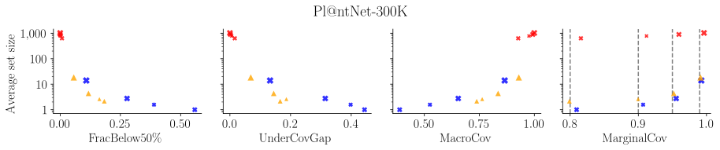{width=100%}

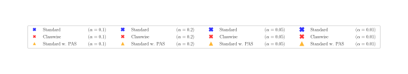{width=100%}

<br> -->

```{=html}

<link rel="preconnect" href="https://fonts.googleapis.com">
<link rel="preconnect" href="https://fonts.gstatic.com" crossorigin>
<link href="https://fonts.googleapis.com/css2?family=Nunito:wght@400;700;800&display=swap" rel="stylesheet">

<style>
/* Override the visualization font from this slide */
#all-metrics-softmax-container,
#all-metrics-softmax-container * {
  font-family: "Nunito", sans-serif !important;
}

/* Plotly SVG text */
#all-metrics-softmax-container svg text {
  font-family: "Nunito", sans-serif !important;
}

/* Plotly axis titles and tick labels */
#all-metrics-softmax-container .xtitle,
#all-metrics-softmax-container .ytitle,
#all-metrics-softmax-container .xtick text,
#all-metrics-softmax-container .ytick text,
#all-metrics-softmax-container .legendtext {
  font-family: "Nunito", sans-serif !important;
}

/* Bold elements */
#all-metrics-softmax-container .scale-btn,
#all-metrics-softmax-container .scale-label,
#all-metrics-softmax-container #image-label,
#all-metrics-softmax-container .legendtext,

#all-metrics-softmax-container .legend .bg {
  width: 900px !important;
}
#all-metrics-softmax-container .legendtext {
  font-size: 18px !important;
  font-family: "Nunito", sans-serif !important;
}

</style>

<style>
/* Fix legend cropping: wider container */
#all-metrics-softmax-container .legend .bg {
  width: 390px !important;
}
#all-metrics-softmax-container .legend .scrollbox {
  width: 390px !important;
}
#all-metrics-softmax-container .legendtext {
  font-size: 11px !important;
}

</style>

<div id="all-metrics-softmax-container" style="width: 100%; height: 450px; margin: 20px 0;">
</div>

<script type="module" src="../../../blog/long-tail/all_metrics_softmax_viz.js"></script>
```

<!-------------------------------------------------------------------------- -->


<!-------------------------------------------------------------------------- -->
### Generalization : weighted Macro-Coverage
<hr>


Given user-chosen class weights $\omega(y)$ for $y \in \mathcal{Y}$ that sum to one, we can define the _$\omega$-weighted macro-coverage_ as


::::{.columns}

::: {.column width="15%"}
:::


::: {.column width="70%"}

$$
\begin{align}
    \mathrm{MacroCov}_{\omega}(\mathcal{C}) =
    \sum_{y \in \mathcal{Y}} \omega(y) \mathbb{P}(Y \in \mathcal{C}(X) \mid Y = y).
\end{align}
$$

::: {.fragment}

::: {.thenv data-text="Theorem (Informal)"}

The optimal set of minimum size and **Macro-Coverage** of at least $1-\alpha$ is:
$$
  \begin{align}
    \mathcal{C}^*(x) = \left\{ y \in \mathcal{Y} : \omega(y) \dfrac{p(y|x)}{p(y)} \geq t\right\},
  \end{align}
$$

:::

:::

:::

::: {.column width="15%"}

:::

::::


::: {.fragment}

<br>

 Introduce a new conformal score, **Weighted Prevalence Adjusted Softmax (WPAS)** : $s(x,y) = \omega(y) \frac{\hat{p}(y|x)}{\hat{p}(y)}$

:::
<!-------------------------------------------------------------------------- -->


<!-------------------------------------------------------------------------- -->
### Experiments on Pl@ntNet-300K: endangered species
<hr>

** Goal:**  handle at-risk species in Pl@ntNet-300K,  weight by $\gamma \geq 1$ times more at-risk species:

$$
\omega(y) = \begin{cases}
    \frac{\gamma}{W} & \text{if } y \in \mathcal{Y}_{\text{at-risk}} \quad (\text{with } W = \gamma|\mathcal{Y}_{\text{at-risk}}| + |\mathcal{Y} \setminus \mathcal{Y}_{\text{at-risk}}|)\\
    \frac{1}{W} & \text{otherwise},
\end{cases}
$$

. . .


```{=html}


<link rel="preconnect" href="https://fonts.googleapis.com">
<link rel="preconnect" href="https://fonts.gstatic.com" crossorigin>
<link href="https://fonts.googleapis.com/css2?family=Nunito:wght@400;700;800&display=swap" rel="stylesheet">

<style>
/* Override the visualization font from this slide */
#plantnet-comparison-container,
#plantnet-comparison-container * {
  font-family: "Nunito", sans-serif !important;
}

/* Plotly SVG text */
#plantnet-comparison-container svg text {
  font-family: "Nunito", sans-serif !important;
}

/* Plotly axis titles and tick labels */
#plantnet-comparison-container .xtitle,
#plantnet-comparison-container .ytitle,
#plantnet-comparison-container .xtick text,
#plantnet-comparison-container .ytick text,


/* Bold elements */
#plantnet-comparison-container .scale-btn,
#plantnet-comparison-container .scale-label,
#plantnet-comparison-container #image-label,
#plantnet-comparison-container .legendtext,

#plantnet-comparison-container .legend .bg {
  width: 480px !important;
}
#plantnet-comparison-container .legendtext {
  font-size: 11px !important;
  font-family: "Nunito", sans-serif !important;
}
#plantnet-comparison-container .legend .scrollbox {
  width: 480px !important;
}
</style>

<div id="plantnet-comparison-container" style="width: 100%; height: 500px; margin: 20px 0;">
</div>

<script type="module" src="../../../blog/long-tail/plantnet_comparison_viz.js"></script>
```
<!-------------------------------------------------------------------------- -->


<!-------------------------------------------------------------------------- -->
### Take home message
<hr>


:::: {.columns}

::: {.column width="65%"}
- Challenges in citizen science: many and varied (need more attention)
- Crowdsourcing / Label uncertainty: helpful for **data curation**
- Improved **data quality** $\implies$ **improved learning** performance
- Prediction: theory can guide the set to display
:::


::: {.column width="33%"}


<!--  -->

:::
::::


:::: {.columns}

::: {.column width="30%"}
**Dataset release**:
:::

::: {.column width="69%"}

- Pl@ntNet-300K: [https://zenodo.org/record/5645731](https://zenodo.org/record/5645731)
- Pl@ntNet SWE flora: [https://zenodo.org/records/10782465](https://zenodo.org/records/10782465)
:::
::::


:::: {.columns}

::: {.column width="30%"}
**Code release**:
:::

::: {.column width="69%"}

- Toolbox: [https://peerannot.github.io/](https://peerannot.github.io/)
- Some benchmarks: [https://benchopt.github.io/](https://benchopt.github.io/)
:::
::::

:::: {.columns}

::: {.column width="30%"}
**Future work**
:::

::: {.column width="69%"}

- Handling label hierarchy
- Human–computer interaction / performative learning / model collapse
- Improve robustness to adversarial users
- Leverage gamification for more quality labels [theplantgame.com](https://theplantgame.com)
:::
::::
<!-------------------------------------------------------------------------- -->


# References {.section-background}


<!----------------------------------------------------------------------- -->
### References
<hr>

::: {#refs}
:::
<script>
document.addEventListener('DOMContentLoaded', function() {
    const refs = document.getElementById('refs');
    if (refs) {
        refs.innerHTML = refs.innerHTML.replace(/Salmon, J\./g, '<strong>Salmon, J.</strong>');
    }
});
</script>
<!-------------------------------------------------------------------------- -->


